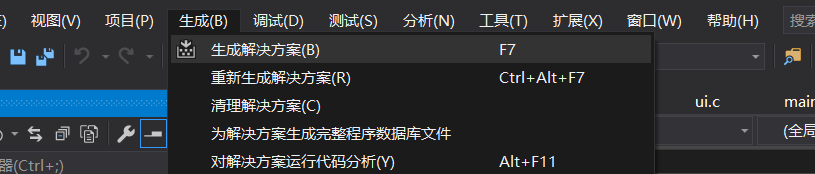
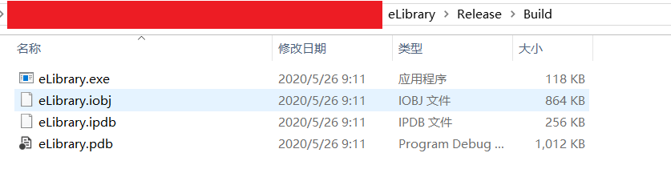
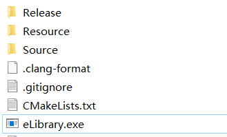
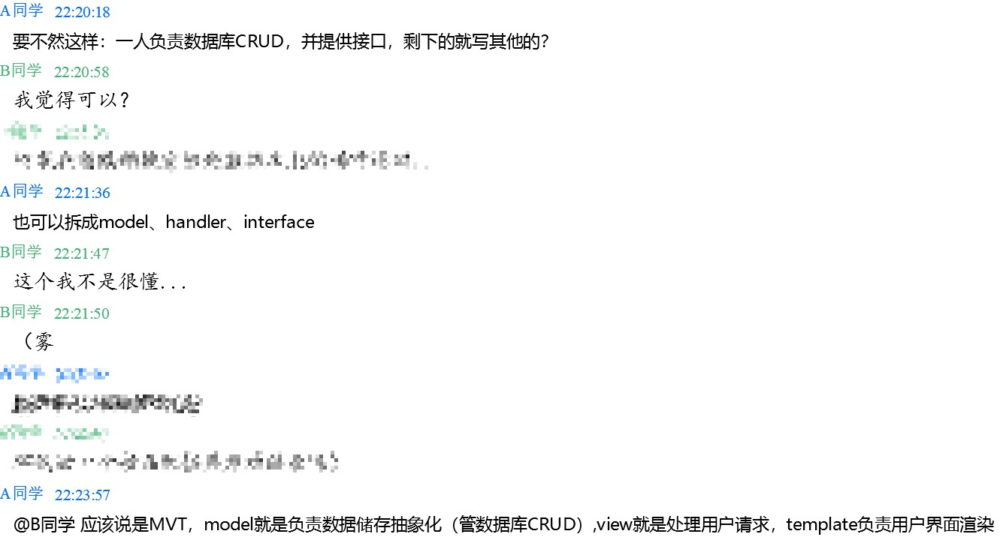
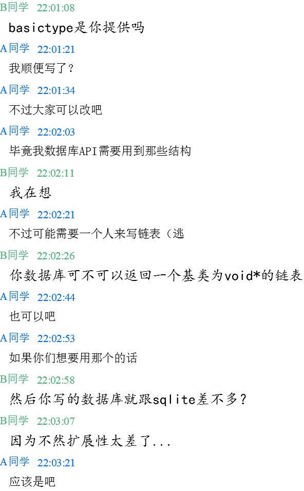
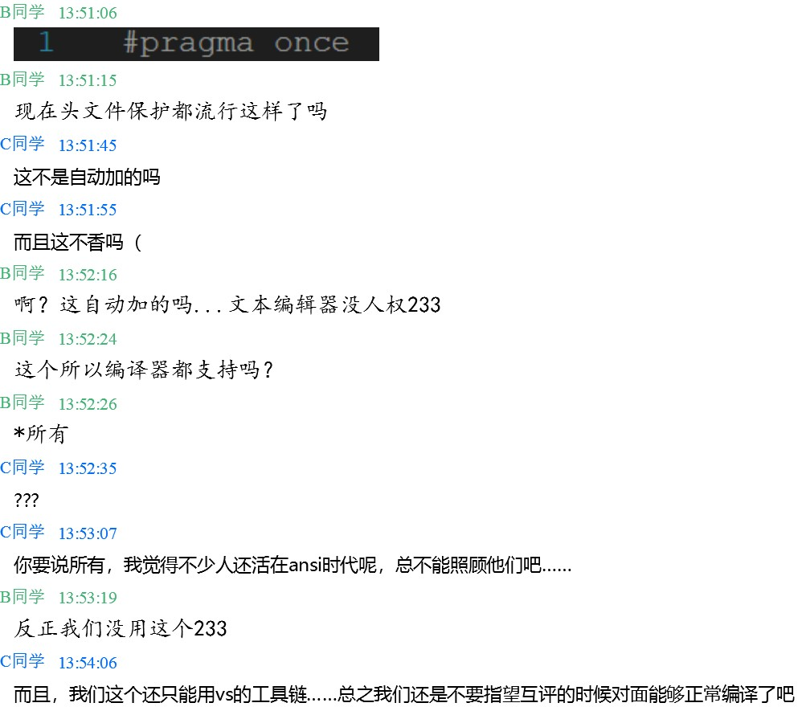
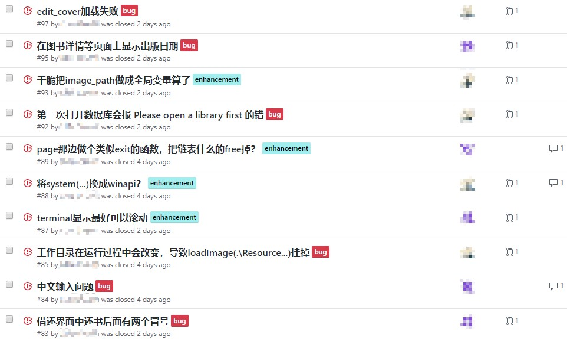

# 1 大程序简介

## 1.1 选题背景及意义
**图书管理系统**是生活中相当常见的管理系统之一，但这些管理系统还是有其缺陷，如无法准确快速的搜索到数据、整体设计复杂繁琐、体积庞大不适用某些小专案。
因此本次我组选题为**图书管理系统**，其一是希望开发一个简易好上手、快速的管理系统；其二是图书管理系统是一个较为整齐且分工明确的项目，且涉及的各个模块实作跨度较大(绘制/排序/查找)，能接触不同领域的开发。  
我组希望透过这次大程实现简易管理系统，能更了解C语言模块化程序设计。

## 1.2 目标要求
* 能更熟悉运用`libgraphics`函数库  
* 能更熟悉文件在C语言中的实现及处理  
* 理解并掌握基本的数据处理，对于往后数据库的学习打下基础
* 理解管理系统的原型    
* 学习如何与他人分工协作  

## 1.3 术语说明

### 深拷贝(deep copy)
指在拷贝时，完全拷贝一个对象的值及其所含的子对象的值到目标对象，深拷贝后将有两个对象出现，并为不同个体，彼此间占用不同内存空间，不互相影响。  
与其相对的是**浅拷贝(shallow copy)**，浅拷贝仅仅传递或赋予指针，实际对象数并没有增加。

### 哈希(hash)
是从一笔数据中，透过一个**哈希函数**，来创建较为简短，具有独特性的**哈希值**（通常以字母和数字）的方法。如此一来，数据便有了统一的代表格式，也可利用**哈希值**来取得原始数据。
除此之外，根据哈希函数的设计，其碰撞(产生重复哈希值)概率、安全性也不同。哈希目前广泛应用於电脑技术中，如数字签名等。

### 栈(stack)
一种常见的数据结构，栈中数据保持先进后出(FILO)的次序。  
### 内联函数(inline functions)
内联函数是一种使用关键词`inline`宣告的函数，用来建议编译器对这些函数进行内联拓展，也就是说将这些函数的函数体取代每一处该调用函数的地方，用以节省调用函数的时间开支。  
内联函数通常为简短但是常调用的函数。
### 模型(model)
模型为数据结构在编程时的抽象表示，与其相对的是**实例(instance)**，代表实际在内存中的数据结构。
# 2 功能需求分析

### 编辑
* 新增
* 复制粘贴 
* 查询 
* 修改、删除
### 检索
* 查找图书
* 查找用户
### 统计
* 分类统计
### 排序
* 根据书号排序
* 根据图书名排序
* 根据作者排序
### 存取
* 数据在内存与文件的转换


# 3 程序开发设计

## 3.1 总体架构设计

## 3.2 功能模块设计

## 3.3 数据结构设计

## 3.4 源代码文件组织设计

## 3.5 函数设计描述

### libgraphics

#### graphics.c

##### loadImage

* 函数原型

  ```c
  void loadImage(const char *image, LibImage *mapbuf);
  ```

* 功能描述

  加载 jpg 图片到一个 LibImage 中

* 参数描述

  * `image`: 图片的存储位置
  * `mapbuf`: 存储 LibImage 的地方

* 返回值描述

  无

* 重要局部变量定义

  ```c
  IPicture *ipicture;
  ```

* 重要局部变量用途描述

  * `ipicture`: 存储指向图片的接口指针

* 函数算法描述

  先读入图片，再通过 Win32API 把图片绘制到 LibImage 中

##### copyImage

* 函数原型

  ```c
  void copyImage(LibImage *dst, LibImage *src);
  ```

* 功能描述

  深拷贝图片

* 参数描述

  * `src`: 指向原图片
  * `dst`: 指向新图片要存储的位置

* 返回值描述

  无

* 重要局部变量定义

  无

* 重要局部变量用途描述

  无

* 函数算法描述

  通过 Win32API 将原 LibImage 中 hbitmap 句柄指向的 bmp 图片深拷贝到新 LibImage 中

##### DrawImage

* 函数原型

  ```c
  void DrawImage(LibImage* pImage, int px_x, int px_y, int px_width,
                 int px_height);
  ```

* 功能描述

  在指定位置绘制图片

* 参数描述

  * `pImage`: 指向要绘制的图片
  * `px_x`: 图片左上角的横轴坐标（像素为单位）
  * `px_y`: 图片左上角的纵轴坐标（像素为单位）
  * `px_width`: 图片要绘制的宽度（像素为单位）
  * `px_height`: 图片要绘制的高度（像素为单位）

* 返回值描述

  无

* 重要局部变量定义

  无

* 重要局部变量用途描述

  无

* 函数算法描述

  创建一个当前窗口的设备上下文环境，使用 Win32API 将图片刷进去，然后刷新这篇区域并释放创建的设备上下文环境

##### SelectFile

* 函数原型

  ```c
  void SelectFile(const char filter[], const char extension[],
                  const bool new_file, char path[], const int max_length);
  ```

* 功能描述

  创建一个 Open dialog box（中文可能叫打开文件对话框），并返回用户选择的文件地址

* 参数描述

  * `filter`: 限制可选择的文件的后缀，如 "JPG image\0\*.jpg;\*.jpeg;*.jpe\0"
  * `extension`: 默认后缀（不含英文句点且3个字符及以内）
  * `new_file`: 是否允许用户新建文件
  * `path[]`: 储存用户选择的文件地址
  * `max_length`: `path[]` 的最大可存储字符数

* 返回值描述

  无

* 重要局部变量定义

  ```c
  OPENFILENAME ofn;
  ```

* 重要局部变量用途描述

  `ofn`: 储存传入参数对于对话框的设置，用于调用 Win32API

* 函数算法描述

  在 `ofn` 中设置好调用者提供的对话框参数之后调用 Win32API

##### SelectFolder

* 函数原型

  ```c
  void SelectFolder(const char hint_text[], char path[]);
  ```

* 功能描述

  创建一个对话框，并返回用户选择的文件夹地址

* 参数描述

  `hint_text`: 在对话框中显示的提示性信息
  `path`: 储存用户选择的文件夹地址（要求至少能存储 `MAX_PATH` 个字符，`MAX_PATH` 在头文件 minwindef.h 中有定义）

* 返回值描述

  无

* 重要局部变量定义

  ```c
  BROWSEINFO bInfo;
  ```

* 重要局部变量用途描述

  * `bInfo`: 储存传入参数对于对话框的设置，用于调用 Win32API

* 函数算法描述

  在 `bInfo` 中设置好调用者提供的对话框参数之后调用 Win32API

### model

#### list.c

##### NewList

* 函数原型

  ```c
  List *NewList();
  ```

* 功能描述

  初始化一个链表

* 参数描述

  无

* 返回值描述

  返回已初始化的链表

* 重要局部变量定义

  无

* 重要局部变量用途描述

  无

* 函数算法描述

  先动态申请空间，然后将 `dummy_head` 和 `dummy_tail` 连起来。返回链表指针

##### DeleteList

* 函数原型

  ```c
  void DeleteList(const List *const list, void (*Free)(void *const value));
  ```

* 功能描述

  删除链表

* 参数描述

  * `list`: 待删除的链表
  * `Free`: 释放链表储存内容的函数

* 返回值描述

* 重要局部变量定义

  无

* 重要局部变量用途描述

  无

* 函数算法描述

  先调用 `ClearList` 再释放 `list` 的空间

##### ClearList

* 函数原型

  ```c
  void ClearList(List *const list, void (*Free)(void *const value));
  ```

* 功能描述

  清空列表

* 参数描述

  * `list`: 待清空的链表
  * `Free`: 释放链表储存内容的函数

* 返回值描述

* 重要局部变量定义

  ```c
  const ListNode *now = list->dummy_head->nxt;
  ```

* 重要局部变量用途描述

  * `now`: 当前待删除的节点

* 函数算法描述

  逐个调用 `EraseList` 删除节点

##### InsertList

* 函数原型

  ```c
  const ListNode *InsertList(List *const list, ListNode *const pos,
                             void *const value);
  ```

* 功能描述

  在指定节点之前插入节点

* 参数描述

  * `list`: 待修改的链表
  * `pos`: 插入节点的位置
  * `value`: 待插入的节点的值

* 返回值描述

  指向插入的节点的指针

* 重要局部变量定义

  ```c
  ListNode *new_node = (ListNode *)malloc(sizeof(ListNode));
  ```

* 重要局部变量用途描述

  * `new_node`: 待插入的节点

* 函数算法描述

  为待插入的节点申请空间，与待插入位置的前后节点相连，更新链表的节点个数。返回插入后的节点

##### EraseList

* 函数原型

  ```c
  const ListNode *EraseList(List *const list, const ListNode *const node,
                            void (*Free)(void *const value));
  ```

* 功能描述

  删除链表中的指定节点

* 参数描述

  * `list`: 待修改的链表
  * `node`: 待删除的节点
  * `Free`: 释放链表储存内容的函数

* 返回值描述

  返回指向删除的节点后面的节点的指针

* 重要局部变量定义

  ```c
  const ListNode *ret = node->nxt;
  ```

* 重要局部变量用途描述

  * `ret`: 存储返回值

* 函数算法描述

  将待删除节点的前后节点相连，释放待删除节点的空间

##### SortList

* 函数原型

  ```c
  void SortList(const List *const list,
                bool (*cmp)(const void *const lhs, const void *const rhs));
  ```

* 功能描述

  对链表进行排序

* 参数描述

  * `list`: 待排序的链表
  * `cmp`: 比较函数，传入两个链表节点的值，返回左边是否小于等于右边

* 返回值描述

  无

* 重要局部变量定义

  ```c
  int l;
  ListNode *now, *left_now, *left_end, *right_now, *right_end;
  ```

* 重要局部变量用途描述

  * `l`: 当前归并的区间长度的一半
  * `now`: 最后一个已排好的节点
  * `left_now` / `left_end`: 第一个待排序的半区间为 [`left_now`, `left_end`)
  * `right_now` / `right_end`: 第二个待排序的半区间为 [`right_now`, `right_end`)

* 函数算法描述

  为了保证排序稳定且排序前后指向链表节点的指针依旧有效，采用归并排序。由于递归太耗时，使用非递归方式归并排序。每次排序倍增待排序的区间长度，然后遍历链表内的所有区间并每次合并两个已排好序的半区间。

##### UniqueList

* 函数原型

  ```c
  void UniqueList(List *const list,
                  bool (*cmp)(const void *const lhs, const void *const rhs),
                  void (*Free)(void *const value));
  ```

* 功能描述

  对已排好序的链表进行去重

* 参数描述

  * `list`: 待排序的链表
  * `cmp`: 比较函数，传入两个链表节点的值，返回左边是否等于右边
  * `Free`: 释放链表储存内容的函数

* 返回值描述

  无

* 重要局部变量定义

  无

* 重要局部变量用途描述

  无

* 函数算法描述

  遍历链表，如果链表中的某个节点与它之前的节点相同，则删除这个节点

##### DuplicateList

* 函数原型

  ```c
  List *DuplicateList(const List *const list,
                      void *const (*Duplicate)(void *const value));
  ```

* 功能描述

  深拷贝指定链表

* 参数描述

  * `list`: 待拷贝的链表
  * `Duplicate`: 深拷贝链表节点的值的函数

* 返回值描述

  指向深拷贝出的链表的指针

* 重要局部变量定义

  无

* 重要局部变量用途描述

  无

* 函数算法描述

  先调用 `NewList` 创建新链表，对老链表的每个节点逐个调用 `Duplicate` 函数深拷贝节点的值，返回新的链表

##### CombineListNode

* 函数原型

  ```c
  static inline void CombineListNode(ListNode *const left, ListNode *const right);
  ```

* 功能描述

  使得传入的两个节点相连

* 参数描述

  * `left`: 待连接的前面的节点
  * `right`: 待链接的后面的节点

* 返回值描述

  无

* 重要局部变量定义

  无

* 重要局部变量用途描述

  无

* 函数算法描述

  使 `left` 的后继为 `right`，使 `right` 的前驱为 `left`

##### MoveListNode

* 函数原型

  ```c
  static inline ListNode *MoveListNode(const List *const list,
                                       const ListNode *const node, int step);
  ```

* 功能描述

  返回指向某节点后面指定个节点的指针

* 参数描述

  * `list`: 节点所在链表
  * `node`: 初始节点
  * `step`: 两节点距离

* 返回值描述

  见功能描述

* 重要局部变量定义

  无

* 重要局部变量用途描述

  无

* 函数算法描述

  从 `node` 节点向后移 `step` 步，除非到达链表末尾

#### model.c(主要函数)
##### OpenDBConnection
* 函数原型
  ```c
  int OpenDBConnection(const char* filename, Model model);
  ```
* 功能描述  
用以初始化，打开数据库文件以供读写，并加载其内容至链表。
* 参数描述  
`filename` - 数据库文件存放地点  
`model` - 数据库的模型(BOOK, USER, BORROWRECORD...)  
* 返回值描述  
`int`, 为`DBErrno`(数据库错误码)
* 函数算法描述  
此函数又以两个辅助函数实现，分别为`DBOpen()`和`DBInit()`，其中`DBOpen()`实现打开数据库文件的
具体功能，而`DBInit()`实现打开文件后将其内容加载至链表的功能。此函数首先以`DBExists()`判断数据库模型是否存在后，先后呼叫这两个函数。
详见`model.c`(辅助函数)中的`DBOpen()`和`DBInit()`。

##### CloseDBConnection
* 函数原型
  ```c
  int CloseDBConnection(Model model);
  ```
* 功能描述  
用以初始化，打开数据库文件以供读写，并加载其内容至链表。
* 参数描述  
`model` - 数据库的模型(BOOK, USER, BORROWRECORD...)
* 返回值描述  
`int`, 为`DBErrno`(数据库错误码)
* 函数算法描述  
此函数又以两个辅助函数实现，分别为`DBClose()`和`DBUninit()`，其中`DBClose()`实现关闭数据库文件的具体功能，而`DBUninit()`实现将链表数据写入文件的功能。此函数首先以`DBExists()`判断数据库模型是否存在后，先后呼叫这两个函数。
详见`model.c`(辅助函数)中的`DBClose()`和`DBUninit()`。

##### Create
* 函数原型
  ```c
  int Create(void* handle, Model model);
  ```
* 功能描述  
在数据库链表中插入一笔新数据。
* 参数描述  
`handle` - 指向一个数据模型实例，代表即将插入的数据。  
`model` - 数据库的模型(BOOK, USER, BORROWRECORD...)   
* 返回值描述  
`DB_FAIL_ON_CREATE` - 代表插入数据失败。  
`DB_SUCCESS` - 代表插入数据成功。  
* 函数算法描述  
先判断当前实例属于哪个模型，再执行插入:深拷贝一份实例，将其插入链表，并将数据库`pk`和`size`的值
各加`1`。关于每个模型的拷贝函数，详见`utils.c`中的`*Copy()`。

##### GetById
* 函数原型
  ```c
  int GetById(void* handle, unsigned int id, Model model);
  ```
* 功能描述  
以`id`查找数据并返回。
* 参数描述  
`handle` - 指向一个数据模型实例，代表即将取得的数据。  
`id` - 实例的id。  
`model` - 数据库的模型(BOOK, USER, BORROWRECORD...)   
* 返回值描述  
`DB_NOT_FOUND` - 找不到数据库。  
`DB_NOT_EXISTS` - 找不到实例。  
`DB_SUCCESS` - 代表查找数据成功。  
* 函数算法描述  
先判断当前实例属于哪个模型，再执行`Find()`查找，然后深拷贝一份实例。关于查找函数，详见`model.c`(辅助函数)的`Find()`。关于每个模型的拷贝函数，详见`utils.c`中的`*Copy()`。


##### Filter
* 函数原型
  ```c
  int Filter(List* list_handle, String queries, Model model);
  ```
* 功能描述  
批量查找数据。
* 参数描述  
`list_handle` - 指向一个数据模型实例链表，代表应获得的数据。  
`queries` - 查找请求。   
`model` - 数据库的模型(BOOK, USER, BORROWRECORD...)   
* 返回值描述  
`DB_NOT_FOUND` - 数据库不存在。  
`DB_SUCCESS` - 代表查找数据成功。  
* 重要局部变量定义
  ```c
  List** data = &DBs[model].data;
  ```
* 重要局部变量用途描述  
`data` - 指向数据库链表在内存中的位置。  
* 函数算法描述  
先判断当前实例属于哪个模型，遍历`*data`的同时，调用相对应`*Filter()`函数判断其是否符合请求，若是，深拷贝一份并插入链表`*list_handle`。关于`*Filter()`，详见`utils.c`(辅助函数)。

##### GetDBSize
* 函数原型
  ```c
  int GetDBSize(Model model, unsigned int *size)；
  ```
* 功能描述  
取得数据库大小。
* 参数描述  
`model` - 数据库的模型(`BOOK`, `USER`, `BORROWRECORD`...)  
`size` - 指针指向即将取得数据库大小的变量  
* 返回值描述  
`DB_NOT_FOUND` - 找不到数据库  
`DB_SUCCESS` - 代表成功。  
* 函数算法描述  
将数据库`size`的值赋给`*size`。
##### GetNextPK
* 函数原型
  ```c
  int GetNextPK(Model model, unsigned int *pk)；
  ```
* 功能描述  
取得下一个尚未使用的`pk`。
* 参数描述  
`model` - 数据库的模型(`BOOK`, `USER`, `BORROWRECORD`...)  
`pk` - 指针指向即将取得数据库`pk`的变量  
* 返回值描述  
`DB_NOT_FOUND` - 找不到数据库  
`DB_SUCCESS` - 代表成功。  
* 函数算法描述  
将数据库`pk`的值赋给`*pk`。

##### Update
* 函数原型
  ```c
  int Update(void* handle, unsigned int id, Model model);
  ```
* 功能描述  
更新链表中的数据实例。
* 参数描述  
`handle` - 指向一个数据模型实例，代表即将插入的数据。  
`id` - 需更新实例的id。  
`model` - 数据库的模型(BOOK, USER, BORROWRECORD...)   
* 返回值描述  
`DB_NOT_FOUND` - 找不到数据库。  
`DB_NOT_EXISTS` - 找不到实例。  
`DB_SUCCESS` - 代表更新数据成功。   
* 重要局部变量定义
  ```c
  ListNode* target
  ```
* 重要局部变量用途描述  
`target`- 指向需更新的实例所属的链表节点。  
* 函数算法描述
使用`Find()`根据`id`查找实例，找到后，深拷贝一份新实例至原实例。关于查找函数，详见`model.c`(辅助函数)的`Find()`。

##### Delete
* 函数原型
  ```c
  int Delete(unsigned int id, Model model);
  ```
* 功能描述  
删除链表中的数据实例。
* 参数描述  
`handle` - 指向一个数据模型实例，代表即将插入的数据。  
`id` - 需更新实例的id。  
`model` - 数据库的模型(BOOK, USER, BORROWRECORD...)   
* 返回值描述  
`DB_FAIL_ON_DELETE` - 删除数据失败。  
`DB_SUCCESS` - 代表删除数据成功。  
* 重要局部变量定义
  ```c
  ListNode* target
  ```
* 重要局部变量用途描述  
`target`- 指向需删除的实例所属的链表节点。  
* 函数算法描述
使用`Find()`根据`id`查找实例，找到后，删除此实例及其相对应节点，并将数据库`size`减`1`。关于查找函数，详见`model.c`(辅助函数)的`Find()`。

#### model.c(辅助函数)
##### DBExists
* 函数原型
  ```c
  inline int DBExists(Model model);
  ```
* 功能描述  
判断数据库模型是否存在。
* 参数描述  
`model` - 整数，代表一个数据库模型。
* 返回值描述  
返回`1`如果数据库模型存在；反之则`0`。
* 函数算法描述  
代表数据库模型的整数必须大于等于0且小于等于宏定义`N_MODEL`才为合法数据库模型，当前`N_MODEL`为3。

##### DBOpen
* 函数原型
  ```c
  int DBOpen(const char* filename, Model model);
  ```
* 功能描述  
打开数据库文件。
* 参数描述  
`filename` - 数据库文件存放地点  
`model` - 数据库的模型(`BOOK`, `USER`, `BORROWRECORD`...)  
* 返回值描述  
`DB_SUCCESS` - 代表数据库文件打开成功。
* 重要局部变量定义  
  ```c
  FILE* database;
  ```
* 重要局部变量用途描述  
`database`- 数据库文件object。
* 函数算法描述  
首先以读+更新形式打开数据库文件，如果打不开或数据库文件不存在，则以只写形式覆盖或新增数据库文件。

##### DBClose
* 函数原型
  ```c
  int DBClose(Model model);
  ```
* 功能描述  
关闭数据库文件。
* 参数描述  
`model` - 数据库的模型(`BOOK`, `USER`, `BORROWRECORD`...)
* 返回值描述  
`DB_NOT_CLOSE` - 代表数据库没有正确关闭。  
`DB_SUCCESS` - 代表数据库文件关闭成功。  
* 函数算法描述  
用`fclose()`关闭文件。

##### DBInit
* 函数原型
  ```c
  int DBInit(Model model);
  ```
* 功能描述  
加载数据库文件至链表。
* 参数描述  
`model` - 数据库的模型(`BOOK`, `USER`, `BORROWRECORD`...)
* 返回值描述   
`DB_ENTRY_EMPTY` - 读取数据时出错导致数据不完整。  
`DB_FAIL_ON_INIT` - 加载数据时出错。  
`DB_SUCCESS` - 代表数据库加载成功。  
* 重要局部变量定义
  ```c
  FILE** database = &DBs[model].database;
  List** data = &DBs[model].data;
  ```
* 重要局部变量用途描述  
`database`- 指向数据库object在内存中的位置。  
`data` - 指向数据库链表在内存中的位置。  
* 函数算法描述
新建链表，再将数据按照格式从`*database`读入字串，读第一遍时若字串为空，代表这是一个新数据库，将数据库的`pk`和`size`初始化为0；若非空，则读入`pk`和`size`。之后的读入皆为读入数据，将读入的字串利用`StringToModel()`转为数据库模型实例，再将实例插入到链表`*data`中。
关于转换，详见`utils.c`的`StringToModel()`。

##### DBUninit
* 函数原型
  ```c
  int DBUninit(Model model);
  ```
* 功能描述  
将数据库链表写入数据库文件中并销毁释放链表。
* 参数描述  
`model` - 数据库的模型(`BOOK`, `USER`, `BORROWRECORD`...)
* 返回值描述   
`DB_NOT_FOUND` - 数据库不存在。  
`DB_FAIL_ON_UNINIT` - 写入文件时出错。  
`DB_SUCCESS` - 代表数据库文件写入成功。  
* 重要局部变量定义
  ```c
  FILE* database = DBs[model].database;
  List* data = DBs[model].data;
  ```
* 重要局部变量用途描述  
`database`- 指向数据库object。  
`data` - 指向数据库链表。  
* 函数算法描述
首先写入数据库`pk`和`size`(第一行)，随后遍历链表，将其连结的数据模型实例用`ModelToString()`转换为字串并写入文件，等所有数据都处理完后，销毁链表。关于转换，详见`utils.c`的`ModelToString()`。

##### Find
* 函数原型
  ```c
  int Find(ListNode** target, unsigned int id, Model model);
  ```
* 功能描述  
遍历链表，根据id找到对应数据模型实例。
* 参数描述  
`target` - 指针指向链表节点存取位置。  
`id` - 实例的id。  
`model` - 数据库的模型(`BOOK`, `USER`, `BORROWRECORD`...)  
* 返回值描述  
`DB_NOT_EXISTS` - 此实例不存在。  
`DB_SUCCESS` - 代表成功找到。  
* 函数算法描述  
判断数据实例为哪个数据模型，再简单`O(n)`遍历相对应的链表。

#### utils.c
##### SaveStrCpy
* 函数原型
  ```c
  int SaveStrCpy(char* t, const char* s);
  ```
* 功能描述  
避免字串为空指针，多了检查的安全拷贝。
* 参数描述  
  `t` - 指针指向拷贝目标  
  `s` - 指针指向拷贝来源  
* 返回值描述  
  `DB_FAIL_ON_FETCHING` - 拷贝失败  
  `DB_SUCCESS` - 拷贝成功  
* 函数算法描述  
先判断字串是否为空指针，再执行拷贝。
##### *Copy
* 函数原型  
  ```c
  int BookCopy(Book* destination, Book* source);
  int UserCopy(User* destination, User* source);
  int RecordCopy(BorrowRecord* destination, BorrowRecord* source);
  ```
* 功能描述  
深拷贝一份实例。
* 参数描述  
`destination` - 拷贝目标  
`source` - 拷贝来源  
* 返回值描述  
  `DB_FAIL_ON_FETCHING` - 拷贝失败  
  `DB_SUCCESS` - 拷贝成功 
* 函数算法描述  
将来源实例结构中的每个变量深拷贝一份到目标实例中。
##### Cmp
* 函数原型  
  ```c
  int Cmp(const char* str1, const char* str2, int insensitive, int equal);
  ```
* 功能描述  
  根据`insensitive`和`equal`判断两字串是否符合关系。
* 参数描述  
  `str1` - 字串1  
  `str2` - 字串2  
  `insenstive` - 是否模糊  
  `equal` - 是否相等  
* 返回值描述  
  回传`1`如果两字串符合关系；反之，回传`0`。
* 函数算法描述  
  如果`insensitive`为真，`str2`在`str1`中则符合关系。如果`insensitive`为假且`equal`为真，两者需相等才符合关系；若`equal`为假，则两者需不相等。
##### *Filter
* 函数原型  
  ```c
  int BookFilter(Book* p_b, String queries);
  int UserFilter(User* p_u, String queries);
  int RecordFilter(BorrowRecord* p_r, String queries);
  ```
* 功能描述  
判断一实例是否符合请求。
* 参数描述  
`p_*` - 指针指向实例。  
`queries` - 请求。  
* 返回值描述  
`int`。如果符合请求，回传`1`；反之回传`0`。
* 重要局部变量定义  
  ```c
  char* property;
  char* para;
  int insensitive;
  int equal;
  ```
* 重要局部变量用途描述  
`property` - 属性，代表实例结构中一个变量。  
`para` - 参数，代表实例结构中变量的值。  
`insensitive` - 是否模糊查找。  
`equal` - 是否相等。  
* 函数算法描述  
使用`strtok()`，按照先`property`后`para`的次序，切割`queries`，得到`property`和`para`的值，再判断`property`是实例结构中的哪个变量，并用`para`与其进行相对应比较。关于比较，详见`Cmp()`。
##### Slice
* 函数原型  
  ```c
  int Slice(const char* str, char* slice, int* pos);
  ```
* 功能描述  
类似`strtok()`的自定义字串切割函数。
* 参数描述  
`str` - 待切割字串。  
`slice` - 切割后的一小段字串切片。  
`pos` - 待切割字串起始点。  
* 返回值描述  
`DB_FAIL_ON_INIT` - 切割时发生错误。  
`DB_SUCCESS` - 切割成功。
* 函数算法描述  
从`pos`开始遍历字串，并将其字元新增至切片，遇到目标字元`;`时停止遍历。
##### StringTo*
* 函数原型  
  ```c
  int StringToBook(Book* p_b, String str);
  int StringToUser(User* p_u, String str);
  int StringToRecord(BorrowRecord* p_r, String str);
  ```
* 功能描述  
  将字串转为指定模型实例。
* 参数描述  
  `p_*` - 指针指向目标实例。  
  `str` - 待转换字串。  
* 返回值描述  
  `DB_FAIL_ON_FETCHING` - 在途中拷贝失败，转换失败。  
  `DB_SUCCESS` - 转换成功。  
* 重要局部变量定义  
  ```c
  int pos;
  ```
* 重要局部变量用途描述  
  `pos` - 字串切割起始点。
* 函数算法描述  
使用切割函数`Slice()`按照数据格式切割字串，得到实例结构变量的值，将其赋予实例结构中的变量。关于切割函数，详见`Slice()`。
##### StringToModel
* 函数原型  
  ```c
  int StringToModel(void** handle, Model model, String str);
  ```
* 功能描述  
  将字串转为模型实例。
* 参数描述  
  `handle` - 指针指向目标模型实例存取位置。  
  `model` - 数据库的模型(`BOOK`, `USER`, `BORROWRECORD`...)  
  `str` - 待转换字串。  
* 返回值描述  
`DB_SUCCESS` - 代表转换成功。 
* 函数算法描述  
先判断当前实例属于的数据模型，再调用相应转换函数`StringTo*()`，详见`StringTo*()`。
##### ModelToString
* 函数原型  
  ```c
  int ModelToString(void* handle, Model model, char* p_str);
  ```
* 功能描述  
将数据实例转换为字串。
* 参数描述  
  `handle` - 指针指向待转换模型实例。  
  `model` - 数据库的模型(`BOOK`, `USER`, `BORROWRECORD`...)  
  `str` - 目标字串。  
* 返回值描述  
`0`，代表成功。
* 重要局部变量定义  
  ```c
  char p_str_2[1000];
  ```
* 重要局部变量用途描述  
`p_str2` - 实例结构中的变量转换而成的部分字串。
* 函数算法描述  
先判断当前实例属于的数据模型，再将实例中的变量一一转换为字串`p_str2`，并将`p_str2`接在`p_str`后面，最后`p_str`会成为完整的字串。

### template

### view

#### main.c

##### Main

* 函数原型

  ```c
  void Main();
  ```

* 功能描述

  调用 template 和 view 的初始化函数，启动程序

* 参数描述

  无

* 返回值描述

  无

* 重要局部变量定义

  无

* 重要局部变量用途描述

  无

* 函数算法描述

  无

#### hash.c

##### Sha256Sum

* 函数原型

  ```c
  void Sha256Sum(uint32_t *const dst, const uint8_t *const src,
                 const uint32_t len);
  ```

* 功能描述

  计算 `src` 中存储的长度为 `len` 的数据的 SHA-256 值并存放在 `dst` 中。将原数据摘要成一个256位的数据。

* 参数描述

  * `dst`: 用以储存哈希值的数组，要求至少 32 字节（也就是 8 个 uint32_t)
  * `src`: 存储原数据的数组
  * `len`: 原数据的长度

* 返回值描述

  无

* 重要局部变量定义

  ```c
  uint32_t n = len / SHA256_BLOCK_SIZE;
  uint32_t m = len % SHA256_BLOCK_SIZE;
  uint8_t cover_data[SHA256_BLOCK_SIZE * 2];
  uint32_t h[8] = { /* details omitted */ };
  ```

* 重要局部变量用途描述

  * `n`: 原数据切分成512位一组后的完整的组数
  * `m`: 原数据切分之后剩余的部分的长度
  * `cover_data`: 原数据切分的多余部分进行补齐之后的数据
  * `h[]`: 哈希值

* 函数算法描述

  先对原数据进行512一组的切分，剩余部分进行补齐并使得新数据的结尾为原数据的比特数（表示形式为64位大端无符号整形）。然后对每一组数据重复 `ChunkProcess` 进行哈希处理，更新 `h[]`。全部处理结束之后 `h[]` 中的数据即为结果。将 `h[]` 中的数据拷贝到 `dst[]` 中

##### ChunkProcess

* 函数原型

  ```c
  static void ChunkProcess(const uint8_t *msg, uint32_t *h);
  ```

* 功能描述

  对 `msg` 中存储的512位数据进行哈希处理并将结果存在 `h[]` 中

* 参数描述

  * `msg`: 512位待进行哈希处理的数据
  * `h[]`: 存储原来的哈希值，新的哈希值也将保存在这里

* 返回值描述

  无

* 重要局部变量定义

  ```c
  static uint32_t k[64] = { /* details omitted */ }
  uint32_t w[64], new_h[8];
  ```

* 重要局部变量用途描述

  * `k[]`: SHA-256 算法中的固定常量
  * `w[]`: 32位的单词。其中前16个单词为传入的512位数据。后48个单词通过固定算法由前面的单词生成
  * `new_h`: 由整个消息（前面生成的单词组 `w[]`）和传入的原哈希值 `h[]` 通过固定算法生成的新的哈希值

* 函数算法描述

  通过各种位运算生成消息并计算其哈希值，详见参考资料

##### RandStr

* 函数原型

  ```c
  void RandStr(char *const dst, const unsigned len);
  ```

* 功能描述

  在 `dst[]` 中生成长度为 `len` 的随机字符串（字典为 ASCII 表（不含扩展表）中的所有可见打印字符）

* 参数描述

  * `dst[]`: 存储随机字符串的数组
  * `len`: 随机字符串的长度

* 返回值描述

  无

* 重要局部变量定义

  无

* 重要局部变量用途描述

  无

* 函数算法描述

  以调用函数时的时间戳为随机种子，逐个生成字符串中的每个字符

#### utility.c

##### InitUtility

* 函数原型

  ```c
  void InitUtility();
  ```

* 功能描述

  初始化日志文件

* 参数描述

  无

* 返回值描述

  无

* 重要局部变量定义

  无

* 重要局部变量用途描述

  无

* 函数算法描述

  无

##### UninitUtility

* 函数原型

  ```c
  void UninitUtility();
  ```

* 功能描述

  关闭日志文件

* 参数描述

  无

* 返回值描述

  无

* 重要局部变量定义

  无

* 重要局部变量用途描述

  无

* 函数算法描述

  无

##### Log

* 函数原型

  ```c
  void Log(char *const msg);
  ```

* 功能描述

  将 `msg[]` 前加上当地时间并写入日志文件

* 参数描述

  `msg[]`: 要写入日志文件的消息

* 返回值描述

  无

* 重要局部变量定义

  ```c
  const time_t cur_time = time(0);
  ```

* 重要局部变量用途描述

  * `cur_time`: 当前时间

* 函数算法描述

  获取当前时间之后先后使用 `loacltime` 函数和 `asctime` 函数将其转换为当地时间的字符串表示，并将字符串结尾的换行符去除。将时间字符串及 `msg[]` 输出到日志文件之中

##### MoveInList

* 函数原型

  ```c
  char *MoveInList(ListNode **const node, List *list, int max_size,
                   bool direction, const char *const list_name,
                   const char *const page_name);
  ```

* 功能描述

  将 `node` 在链表 `list` 中的指向向 `direction`（0为向前，1为向后）方向移动 `max_size` 个节点，并返回相应的日志消息（当前链表名为 `list_name`，当前界面名为 `page_name`）

* 参数描述

  见功能描述

* 返回值描述

  见功能描述

* 重要局部变量定义

  无

* 重要局部变量用途描述

  无

* 函数算法描述

  见功能描述。注意如果移动失败（超过链表结尾或开头）则 `node` 的指向不变并返回报告出错的日志消息

##### ErrorHandle

* 函数原型

  ```c
  bool ErrorHandle(int errno_, int num, ...)
  ```

* 功能描述

  处理数据库操作的返回值，如果数据库操作失败，则绘制历史记录中的上一个页面并显示错误信息

* 参数描述

  * `errno_`: 数据库操作返回的错误码
  * `num`: 可变参数的个数
  * 可变参数: 可以视作成功的错误码

* 返回值描述

  如果为 FALSE 则表示数据库操作成功，如果为 TRUE 则表示数据库操作失败

* 重要局部变量定义

  无

* 重要局部变量用途描述

  无

* 函数算法描述

  见功能描述

##### InitCheck

* 函数原型

  ```c
  bool InitCheck(bool no_user);
  ```

* 功能描述

  验证数据库是否打开以及当前是否有用户登录，检查如果失败则绘制历史记录中的上一个页面并显示错误信息

* 参数描述

  `no_user`: TRUE 表示可以接受没有用户登录

* 返回值描述

  TRUE 表示检查失败（如数据库未打开或用户未登录），FALSE 表示检查没有问题

* 重要局部变量定义

  无

* 重要局部变量用途描述

  无

* 函数算法描述

  见功能描述

##### CmpGreaterBorrowRecordByReturnTime

* 函数原型

  ```c
  bool CmpGreaterBorrowRecordByReturnTime(const void *const lhs,
                                          const void *const rhs)
  ```

* 功能描述

  以归还时间为关键字比较两个指向 BorrowRecord 的指针

* 参数描述

  *  `lhs`: 指向不等号左边的值的指针
  *  `rhs`: 指向不等号右边的值的指针

* 返回值描述

  返回 `lhs` 的归还时间是否大于等于 `rhs`

* 重要局部变量定义

  无

* 重要局部变量用途描述

  无

* 函数算法描述

  无

##### CmpLessBorrowRecordByReturnTime

* 函数原型

  ```c
  bool CmpLessBorrowRecordByReturnTime(const void *const lhs,
                                       const void *const rhs)
  ```

* 功能描述

  以归还时间为关键字比较两个指向 BorrowRecord 的指针

* 参数描述

  *  `lhs`: 指向不等号左边的值的指针
  *  `rhs`: 指向不等号右边的值的指针

* 返回值描述

  返回 `lhs` 的归还时间是否小于等于 `rhs`

* 重要局部变量定义

  无

* 重要局部变量用途描述

  无

* 函数算法描述

  无

##### CmpLessBookById

* 函数原型

  ```c
  bool CmpLessBookById(const void *const lhs, const void *const rhs);
  ```

* 功能描述

  以书号为关键字比较两个指向 Book 的指针

* 参数描述

  *  `lhs`: 指向不等号左边的值的指针
  *  `rhs`: 指向不等号右边的值的指针

* 返回值描述

  返回 `lhs` 的书号是否小于等于 `rhs`

* 重要局部变量定义

  无

* 重要局部变量用途描述

  无

* 函数算法描述

  无

##### CmpLessBookByTitle

* 函数原型

  ```c
  bool CmpLessBookByTitle(const void *const lhs, const void *const rhs);
  ```

* 功能描述

  以书名为关键字比较两个指向 Book 的指针

* 参数描述

  *  `lhs`: 指向不等号左边的值的指针
  *  `rhs`: 指向不等号右边的值的指针

* 返回值描述

  返回 `lhs` 的书名是否小于等于 `rhs`

* 重要局部变量定义

  无

* 重要局部变量用途描述

  无

* 函数算法描述

  无

##### CmpLessBookByAuthor

* 函数原型

  ```c
  bool CmpLessBookByAuthor(const void *const lhs, const void *const rhs);
  ```

* 功能描述

  以第一作者为关键字比较两个指向 Book 的指针

* 参数描述

  *  `lhs`: 指向不等号左边的值的指针
  *  `rhs`: 指向不等号右边的值的指针

* 返回值描述

  返回 `lhs` 的第一作者是否小于等于 `rhs`

* 重要局部变量定义

  无

* 重要局部变量用途描述

  无

* 函数算法描述

  无

##### CmpLessUserById

* 函数原型

  ```c
  bool CmpLessUserById(const void *const lhs, const void *const rhs);
  ```

* 功能描述

  以第一作者为关键字比较两个指向 User 的指针

* 参数描述

  *  `lhs`: 指向不等号左边的值的指针
  *  `rhs`: 指向不等号右边的值的指针

* 返回值描述

  返回 `lhs` 的用户号是否小于等于 `rhs`

* 重要局部变量定义

  无

* 重要局部变量用途描述

  无

* 函数算法描述

  无

##### CmpLessUserByName

* 函数原型

  ```c
  bool CmpLessUserByName(const void *const lhs, const void *const rhs);
  ```

* 功能描述

  以第一作者为关键字比较两个指向 User 的指针

* 参数描述

  *  `lhs`: 指向不等号左边的值的指针
  *  `rhs`: 指向不等号右边的值的指针

* 返回值描述

  返回 `lhs` 的姓名是否小于等于 `rhs`

* 重要局部变量定义

  无

* 重要局部变量用途描述

  无

* 函数算法描述

  无

##### CmpLessUserByDepartment

* 函数原型

  ```c
  bool CmpLessUserByDepartment(const void *const lhs, const void *const rhs);
  ```

* 功能描述

  以第一作者为关键字比较两个指向 User 的指针

* 参数描述

  *  `lhs`: 指向不等号左边的值的指针
  *  `rhs`: 指向不等号右边的值的指针

* 返回值描述

  返回 `lhs` 的部门是否小于等于 `rhs`

* 重要局部变量定义

  无

* 重要局部变量用途描述

  无

* 函数算法描述

  无

##### StrCpy

* 函数原型

  ```c
  void *const StrCpy(void *const str);
  ```

* 功能描述

  深拷贝 `str` 中储存的字符串

* 参数描述

  * `str`: 待拷贝的字符串

* 返回值描述

  * 返回复制出的字符串

* 重要局部变量定义

  * 无

* 重要局部变量用途描述

  * 无

* 函数算法描述

  使用 `malloc` 为返回的字符串分配空间然后 `strcpy` 过去

##### StrLess

* 函数原型

  ```c
  bool StrLess(const void *const lhs, const void *rhs);
  ```

* 功能描述

  比较两个字符串

* 参数描述

  *  `lhs`: 指向不等号左边的值的指针
  *  `rhs`: 指向不等号右边的值的指针

* 返回值描述

  返回 `lhs` 是否小于等于 `rhs`

* 重要局部变量定义

* 重要局部变量用途描述

* 函数算法描述

##### StrSame

* 函数原型

  ```c
  bool StrSame(const void *const lhs, const void *rhs);
  ```

* 功能描述

  比较两个字符串

* 参数描述

  *  `lhs`: 指向不等号左边的值的指针
  *  `rhs`: 指向不等号右边的值的指针

* 返回值描述

  返回 `lhs` 是否等于 `rhs`

* 重要局部变量定义

* 重要局部变量用途描述

* 函数算法描述

##### GetTime

* 函数原型

  ```c
  char *GetTime(time_t dst_tm);
  ```

* 功能描述

  将 time_t 转换成格式为 YYYYMMDD 的字符串。

* 参数描述

  * `dst_tm`: 需要转换的时间戳

* 返回值描述

  返回对应字符串。注意：指针指向静态储存区，请不要 `free`

* 重要局部变量定义

  无

* 重要局部变量用途描述

  无

* 函数算法描述

  无

##### GetBorrowRecordNumberAfter

* 函数原型

  ```c
  int GetBorrowRecordNumberAfter(List *borrow_record, time_t dst_tm);
  ```

* 功能描述

  统计链表 `borrow_record` 中借阅时间在 `dst_tm` 之后的借阅记录的个数

* 参数描述

  * `borrow_record`: 待统计的借阅记录。注意：在传入之前应先按归还时间的降序排序
  * `det_tm`: 要求的时间

* 返回值描述

  满足要求的借阅记录的个数

* 重要局部变量定义

  无

* 重要局部变量用途描述

  无

* 函数算法描述

  遍历整个链表直至归还时间早于要求的时间。（由于调用此函数时链表均已按照归还时间排序过，所以可以这样剪枝）

#### history.c

##### InitHistory

* 函数原型

  ```c
  void InitHistory();
  ```

* 功能描述

  初始化历史记录

* 参数描述

  无

* 返回值描述

  无

* 重要局部变量定义

  无

* 重要局部变量用途描述

  无

* 函数算法描述

  初始化历史记录链表

##### UninitHistory

* 函数原型

  ```c
  void UninitHistory();
  ```

* 功能描述

  关闭历史记录模块

* 参数描述

  无

* 返回值描述

  无

* 重要局部变量定义

  无

* 重要局部变量用途描述

  无

* 函数算法描述

  清空并释放历史记录列表

##### TopHistory

* 函数原型

  ```c
  History *const TopHistory();
  ```

* 功能描述

  返回历史记录模块中栈顶的历史记录（函数只是为了提高代码简洁性，只要编译器优化级别不过于保守，应该会自动内联）

* 参数描述

  无

* 返回值描述

  指向栈顶历史记录的指针

* 重要局部变量定义

  无

* 重要局部变量用途描述

  无

* 函数算法描述

  无

##### PushHistory

* 函数原型

  ```c
  void PushBackHistory(History *const new_history);
  ```

* 功能描述

  向栈中压入新的历史记录

* 参数描述

  `new_history`: 指向新历史记录的指针

* 返回值描述

  无

* 重要局部变量定义

  无

* 重要局部变量用途描述

  无

* 函数算法描述

  直接加入链表末尾，如果链表大小超过设置的历史记录上限，则弹出链表开头的历史记录

##### PopHistory

* 函数原型

  ```c
  void PopBackHistory();
  ```

* 功能描述

  弹出栈顶历史记录

* 参数描述

  无

* 返回值描述

  无

* 重要局部变量定义

  无

* 重要局部变量用途描述

  无

* 函数算法描述

  无

##### ClearHistory

* 函数原型

  ```c
  void ClearHistory();
  ```

* 功能描述

  清空历史记录

* 参数描述

  无

* 返回值描述

  无

* 重要局部变量定义

  无

* 重要局部变量用途描述

  无

* 函数算法描述

  不断调用 `PopBackHistory` 直至栈为空

##### FreeHistory

* 函数原型

  ```c
  void FreeHistory(void *const history_);
  ```

* 功能描述

  释放历史记录的栈中的元素的内存

* 参数描述

  * `history_`: 指向要释放的历史记录的指针

* 返回值描述

  无

* 重要局部变量定义

  无

* 重要局部变量用途描述

  无

* 函数算法描述

  释放历史记录中动态申请出来的内存（如链表、字符串等）

##### ReturnHistory

* 函数原型

  ```c
  void ReturnHistory(ListNode *go_back_to, char *msg);
  ```

* 功能描述

  回滚到指定的历史记录，并输出相应的日志信息

* 参数描述

  * `go_back_to`: 指向要回滚到的历史记录
  * `msg`: 要输出的日志信息

* 返回值描述

  无

* 重要局部变量定义

  无

* 重要局部变量用途描述

  无

* 函数算法描述

  根据要回滚到的历史记录的页面不同绘制对应的页面，如果栈被清空了，则绘制欢迎界面

#### view.c

##### InitView

* 函数原型

  ```c
  void InitView();
  ```

* 功能描述

  初始化 view 模块

* 参数描述

  无

* 返回值描述

  无

* 重要局部变量定义

  无

* 重要局部变量用途描述

  无

* 函数算法描述

  调用 `InitHistory` 与 `InitUtility`，加载资源并绘制欢迎界面

##### NavigationCallback

* 函数原型

  ```c
  void NavigationCallback(Page nav_page);
  ```

* 功能描述

  响应用户导航栏的操作

* 参数描述

  * `nav_page`: 用户选择的界面

* 返回值描述

  无

* 重要局部变量定义

  无

* 重要局部变量用途描述

  无

* 函数算法描述

  调用对应的处理函数

##### Navigation_LendAndBorrow

* 函数原型

  ```c
  void Navigation_LendAndBorrow(char *msg);
  ```

* 功能描述

  处理 LendAndBorrow 界面需要显示的东西并调用绘制函数

* 参数描述

  * `msg`: 日志消息，如果为空则函数自行生成

* 返回值描述

  无

* 重要局部变量定义

  ```c
  List *borrow_records_list = NewList();
  List *books = NewList();
  History *const new_history = malloc(sizeof(History));
  ```

* 重要局部变量用途描述

  * `borrow_records_list`: 当前用户还没有归还的图书借阅记录
  * `books`: 对应的借阅记录的图书
  * `new_history`: 这一次的历史记录

* 函数算法描述

  从借阅记录数据库中筛选出所有满足要求的借阅记录，再遍历一遍，从图书数据库中提取出对应的图书，初始化这一次历史记录的各个参数，调用 `DrawUI`

##### Navigation_BookSearch

* 函数原型

  ```c
  void Navigation_BookSearch(char *msg);
  ```

* 功能描述

  处理 BookSearch 界面需要显示的东西并调用绘制函数

* 参数描述

  * `msg`: 日志消息，如果为空则函数自行生成

* 返回值描述

  无

* 重要局部变量定义

  无

* 重要局部变量用途描述

  无

* 函数算法描述

  导航栏单击图书搜索相当于关键字为空的图书搜索，直接调用 `BookSearchDisplay` 做进一步的处理

##### Navigation_UserSearch

* 函数原型

  ```c
  void Navigation_UserSearch(char *msg);
  ```

* 功能描述

  处理 UserSearch 界面需要显示的东西并调用绘制函数

* 参数描述

  * `msg`: 日志消息，如果为空则函数自行生成

* 返回值描述

  无

* 重要局部变量定义

  无

* 重要局部变量用途描述

  无

* 函数算法描述

  导航栏单击用户搜索相当于关键字为空的用户搜索，直接调用 `UserSearchDisplay` 做进一步的处理

##### Navigation_ManualOrAbout

* 函数原型

  ```c
  void Navigation_ManualOrAbout(bool type, char *msg);
  ```

* 功能描述

  处理 Manual 或者 About 界面需要显示的东西并调用绘制函数

* 参数描述

  * `type`: 0 表示绘制 Manual，1 表示绘制 About
  * `msg`: 日志消息，如果为空则函数自行生成

* 返回值描述

  无

* 重要局部变量定义

  ```c
  History *const new_history = malloc(sizeof(History));
  ```

* 重要局部变量用途描述

  * `new_history`: 这一次的历史记录

* 函数算法描述

  初始化这一次历史记录的各个参数，调用 `DrawUI`

##### Navigation_UserLogInOrRegister

* 函数原型

  ```c
  void Navigation_UserLogInOrRegister(bool type, char *msg);
  ```

* 功能描述

  处理 LogIn 或者 Register 界面需要显示的东西并调用绘制函数

* 参数描述

  * `type`: 0 表示绘制 Manual，1 表示绘制 About
  * `msg`: 日志消息，如果为空则函数自行生成

* 重要局部变量定义

  ```c
  History *const new_history = malloc(sizeof(History));
  ```

* 重要局部变量用途描述

  * `new_history`: 这一次的历史记录

* 函数算法描述

  先退出当前用户，然后初始化这一次历史记录的各个参数，调用 `DrawUI`

##### Navigation_UserLogOut

* 函数原型

  ```c
  void Navigation_UserLogOut(char *msg);
  ```

* 功能描述

  登出当前用户并绘制 Welcome 界面

* 参数描述

  * `msg`: 日志消息，如果为空则函数自行生成

* 返回值描述

  无

* 重要局部变量定义

  ```c
  History *const new_history = malloc(sizeof(History));
  ```

* 重要局部变量用途描述

  * `new_history`: 这一次的历史记录

* 函数算法描述

  见功能描述

##### Navigation_UserModify

* 函数原型

  ```c
  void Navigation_UserModify(char *msg);
  ```

* 功能描述

  处理 UserModify 界面需要显示的东西并调用绘制函数

* 参数描述

  * `msg`: 日志消息，如果为空则函数自行生成

* 返回值描述

  无

* 重要局部变量定义

  无

* 重要局部变量用途描述

  无

* 函数算法描述

  直接调用 `UserSearchInfoDisplay`，其中要显示的用户为当前用户

##### Navigation_UserManagement

* 函数原型

  ```c
  void Navigation_UserManagement(char *msg);
  ```

* 功能描述

  处理 UserManagement 界面需要显示的东西并调用绘制函数

* 参数描述

  * `msg`: 日志消息，如果为空则函数自行生成

* 返回值描述

  无

* 重要局部变量定义

  ```c
  List *to_be_verified = NewList();
  List *verified = NewList();
  History *const new_history = malloc(sizeof(History));
  ```

* 重要局部变量用途描述

  * `to_be_verified`: 待审核的用户列表
  * `verified`: 已审核有效的用户列表
  * `new_history`: 这一次的历史记录

* 函数算法描述

  从用户数据库中提取出两个用户列表，然后初始化这一次历史记录的各个参数，调用 `DrawUI`

##### Navigation_Library

* 函数原型

  ```c
  void Navigation_Library(char *msg);
  ```

* 功能描述

  处理 Library 界面需要显示的东西并调用绘制函数

* 参数描述

  * `msg`: 日志消息，如果为空则函数自行生成

* 返回值描述

  无

* 重要局部变量定义

  ```c
  List *books = NewList();
  History *const new_history = malloc(sizeof(History));
  ```

* 重要局部变量用途描述

  * `books`: 要显示的图书
  * `new_history`: 这一次的历史记录

* 函数算法描述

  从图书数据库中提取出所有图书，然后初始化这一次历史记录的各个参数，调用 `DrawUI`

##### Navigation_OpenOrInitLibrary

* 函数原型

  ```c
  void Navigation_OpenOrInitLibrary(bool type, char *msg);
  ```

* 功能描述

  打开或者新建一个图书库

* 参数描述

  * `type`: 0 表示打开，1 表示新建
  * `msg`: 日志消息，如果为空则函数自行生成

* 返回值描述

  无

* 重要局部变量定义

  ```c
  static bool opened = FALSE;
  int flag = 0;
  History *const new_history = malloc(sizeof(History));
  ```

* 重要局部变量用途描述

  * `opened`: 之前是否打开过某个数据库
  * `flag`: 0 => 无事发生 1=> 有swap文件 2=> 无文件 （3个状态有可能同时存在，使用位运算读取）
  * `new_history`: 这一次的历史记录

* 函数算法描述

  调用 `SelectFolder` 使用户选择一个文件夹，如果是新建图书库则新建一个 image 文件夹，如果有之前数据库的 swap 文件（这意味着上次一场退出了）则优先打开 swap 文件。清空历史记录并退出当前用户，绘制 Welcome 界面

##### Navigation_SaveLibrary

* 函数原型

  ```c
  void Navigation_SaveLibrary(bool type, char *msg);
  ```

* 功能描述

  保存一个图书库

* 参数描述

  * `type`: 0 表示不回退到上一个界面，1 表示回退到上一个界面
  * `msg`: 日志消息，如果为空则函数自行生成

* 返回值描述

  无

* 重要局部变量定义

  无

* 重要局部变量用途描述

  无

* 函数算法描述

  复制数据库的 swap 文件

##### Navigation_BookDisplayOrInit

* 函数原型

  ```c
  void Navigation_BookDisplayOrInit(Book *book, bool type, char *msg);
  ```

* 功能描述

  处理 BookDisplay 或者 BookInit 界面需要显示的东西并调用绘制函数

* 参数描述

  * `book`: 要显示的图书
  * `type`: 0 表示图书显示，1 表示图书新建
  * `msg`: 日志消息，如果为空则函数自行生成

* 返回值描述

  无

* 重要局部变量定义

  ```c
  History *const new_history = malloc(sizeof(History));
  ```

* 重要局部变量用途描述

  * `new_history`: 这一次的历史记录

* 函数算法描述

  用 `loadImage` 或者 `copyImage` 加载图书封面，然后初始化这一次历史记录的各个参数，调用 `DrawUI`

##### Navigation_BookInit

* 函数原型

  ```c
  void Navigation_BookInit(char *msg);
  ```

* 功能描述

  生成 BookInit 界面

* 参数描述

  * `msg`: 日志消息，如果为空则函数自行生成

* 返回值描述

  无

* 重要局部变量定义

  ```c
  Book *book = malloc(sizeof(Book));
  ```

* 重要局部变量用途描述

  * `book`: 要新建的图书

* 函数算法描述

  通过 `GetNextPk` 获得要新建的图书的主键，存入 `book` 中，然后调用 `Navigation_BookDisplayOrInit`

##### Navigation_Statistics

* 函数原型

  ```c
  void Navigation_Statistics(char *msg);
  ```

* 功能描述

  处理 Statistics 界面需要显示的东西并调用绘制函数

* 参数描述

  * `msg`: 日志消息，如果为空则函数自行生成

* 返回值描述

  无

* 重要局部变量定义

  ```c
  List *book = NewList(), *category = NewList();
  List *borrow_record = NewList();
  History *const new_history = malloc(sizeof(History));
  ```

* 重要局部变量用途描述

  * `book`: 图书数据库中的所有书
  * `category`: 所有分类
  * `borrow_record`: 借还记录数据库中所有借还记录
  * `new_history`: 这一次的历史记录

* 函数算法描述

  提取出所有书，将书的分类都放到一个链表中，对这个链表排序再去重，获得所有分类。提取出所有借还记录。然后初始化这一次历史记录的各个参数，调用 `DrawUI`

##### Navigation_Return

* 函数原型

  ```c
  void Navigation_Return(char *msg);
  ```

* 功能描述

  绘制上一个界面

* 参数描述

  * `msg`: 日志消息，如果为空则函数自行生成

* 返回值描述

  无

* 重要局部变量定义

  无

* 重要局部变量用途描述

  无

* 函数算法描述

  直接调用 `ReturnHistory`。如果历史记录不够了则不返回

##### Navigation_Exit

* 函数原型

  ```c
  void Navigation_Exit()
  ```

* 功能描述

  退出整个程序

* 参数描述

  无

* 返回值描述

  无

* 重要局部变量定义

  无

* 重要局部变量用途描述

  无

* 函数算法描述

  保存并关闭所有数据库，关闭历史记录模块和日志模块，关闭程序

##### BookDisplayAdminDisplay

* 函数原型

  ```c
  void BookDisplayAdminDisplay(char *msg);
  ```

* 功能描述

  处理 BorrowDisplay 界面需要显示的东西并调用绘制函数

* 参数描述

  * `msg`: 日志消息，如果为空则函数自行生成

* 返回值描述

  无

* 重要局部变量定义

  ```c
  List *borrow_record = NewList();
  History *const new_history = malloc(sizeof(History));
  ```

* 重要局部变量用途描述

  * `borrow_record`: 这本书的借还记录
  * `new_history`: 这一次的历史记录

* 函数算法描述

  从借还记录数据库中获得这本书的借还记录。然后初始化这一次历史记录的各个参数，调用 `DrawUI`

##### BookSearchDisplay

* 函数原型

  ```c
  void BookSearchDisplay(char *keyword, char *msg);
  ```

* 功能描述

  绘制指定关键词的图书搜索界面

* 参数描述

  * `keyword`: 指定的关键词
  * `msg`: 日志消息，如果为空则函数自行生成

* 返回值描述

  无

* 重要局部变量定义

  ```c
  List *results = NewList();
  History *const new_history = malloc(sizeof(History));
  ```

* 重要局部变量用途描述

  * `results`: 搜索结果
  * `new_history`: 这一次的历史记录

* 函数算法描述

  在图书数据库中得到搜索结果。然后初始化这一次历史记录的各个参数，调用 `DrawUI`

##### UserSearchDisplay

* 函数原型

  ```c
  void UserSearchDisplay(char *keyword, char *msg);
  ```

* 功能描述

  绘制指定关键词的用户搜索界面

* 参数描述

  * `keyword`: 指定的关键词
  * `msg`: 日志消息，如果为空则函数自行生成

* 返回值描述

  无

* 重要局部变量定义

  ```c
  List *results = NewList();
  History *const new_history = malloc(sizeof(History));
  ```

* 重要局部变量用途描述

  * `results`: 搜索结果
  * `new_history`: 这一次的历史记录

* 函数算法描述

  在用户数据库中得到搜索结果。然后初始化这一次历史记录的各个参数，调用 `DrawUI`

##### UserSearchInfoDisplay

* 函数原型

  ```c
  void UserSearchInfoDisplay(User *show_user, char *msg);
  ```

* 功能描述

  绘制指定用户的详细信息

* 参数描述

  * `show_user`: 要绘制的用户
  * `msg`: 日志消息，如果为空则函数自行生成

* 返回值描述

  无

* 重要局部变量定义

  ```c
  List *borrow_record = NewList();
  History *const new_history = malloc(sizeof(History));
  ```

* 重要局部变量用途描述

  * `borrow_record`: 该用户的借阅记录
  * `new_history`: 这一次的历史记录

* 函数算法描述

  在借阅记录数据库中得到该用户的借阅记录。然后初始化这一次历史记录的各个参数，调用 `DrawUI`

##### BookSearch_BorrowCallback

* 函数原型

  ```c
  static void BookSearch_BorrowCallback(Book *book);
  ```

* 功能描述

  图书搜索的借阅按钮回调

* 参数描述

  * `book`: 用户要借的书

* 返回值描述

  无

* 重要局部变量定义

  ```c
  BorrowRecord new_record;
  ```

* 重要局部变量用途描述

  * `new_record`: 新的借阅记录

* 函数算法描述

  减少书本在架书数，建立新的借阅记录

##### BookSearch_BookCallback

* 函数原型

  ```c
  void BookSearch_BookCallback(Book *book);
  ```

* 功能描述

  图书搜索的图书详情按钮回调

* 参数描述

  * `book`: 要看详情的书

* 返回值描述

  无

* 重要局部变量定义

  无

* 重要局部变量用途描述

  无

* 函数算法描述

  直接调用 `Navigation_BookDisplayOrInit`

##### BookSearch_SearchCallback

* 函数原型

  ```c
  void BookSearch_SearchCallback(char *keyword);
  ```

* 功能描述

  图书搜索的搜索按钮回调

* 参数描述

  * `keyword`: 搜索关键字

* 返回值描述

  无

* 重要局部变量定义

  无

* 重要局部变量用途描述

  无

* 函数算法描述

  深拷贝关键字之后直接调用 `BookSearchDisplay`

##### BookSearch_TurnPage

* 函数原型

  ```c
  void BookSearch_TurnPage(bool direction);
  ```

* 功能描述

  图书搜索的翻页按钮回调

* 参数描述

  * `direction`: 0 表示向前，1 表示向后

* 返回值描述

  无

* 重要局部变量定义

  无

* 重要局部变量用途描述

  无

* 函数算法描述

  直接调用 `MoveInList`，然后调用 `DrawUI`

##### LendAndBorrow_SearchCallback

* 函数原型

  ```c
  void LendAndBorrow_SearchCallback(char *keyword);
  ```

* 功能描述

  借还的搜索按钮回调

* 参数描述

  无

* 返回值描述

  无

* 重要局部变量定义

  无

* 重要局部变量用途描述

  无

* 函数算法描述

  直接调用 `BookSearch_SearchCallback`

##### LendAndBorrow_ReturnCallback

* 函数原型

  ```c
  void LendAndBorrow_ReturnCallback(ListNode *book, ListNode *borrow_record);
  ```

* 功能描述

  借还的还书按钮回调

* 参数描述

  * `book`: 要还的书
  * `borrow_record`: 对应的借阅记录

* 返回值描述

  无

* 重要局部变量定义

  无

* 重要局部变量用途描述

  无

* 函数算法描述

  增加要还的书的在架数，将借还记录的状态改成已还并更新还书的时间

##### LendAndBorrow_TurnPage

* 函数原型

  ```c
  void LendAndBorrow_TurnPage(bool direction);
  ```

* 功能描述

  借还的翻页按钮回调

* 参数描述

  * `direction`: 0 表示向前，1 表示向后

* 返回值描述

  无

* 重要局部变量定义

  无

* 重要局部变量用途描述

  无

* 函数算法描述

  直接调用 `MoveInList`，然后调用 `DrawUI`

##### UserModify_ConfirmCallback

* 函数原型

  ```c
  void UserModify_ConfirmCallback();
  ```

* 功能描述

  用户修改的确认按钮回调

* 参数描述

  无

* 返回值描述

  无

* 重要局部变量定义

  ```c
  List *users = NewList();
  ```

* 重要局部变量用途描述

  * `users`: 与试图更新的用户用户号相同的用户

* 函数算法描述

  如果当前用户和待修改用户权限等级相同，则检查密码是否正确。如果设置了新密码则检查重复的新密码是否正确。验证新的用户号是否合法（不为空且不重复）。更新数据库并调用 `ReturnHistory`

##### UserModify_TurnPage

* 函数原型

  ```c
  void UserModify_TurnPage(bool direction);
  ```

* 功能描述

  用户修改的翻页按钮回调

* 参数描述

  * `direction`: 0 表示向前，1 表示向后

* 返回值描述

  无

* 重要局部变量定义

  无

* 重要局部变量用途描述

  无

* 函数算法描述

  直接调用 `MoveInList`，然后调用 `DrawUI`

##### UserSearch_InfoCallback

* 函数原型

  ```c
  void UserSearch_InfoCallback(User *show_user);
  ```

* 功能描述

  用户搜索的详细信息回调

* 参数描述

  * `show_user`: 要显示的用户

* 返回值描述

  无

* 重要局部变量定义

  无

* 重要局部变量用途描述

  无

* 函数算法描述

  直接调用 `UserSearchInfoDisplay`

##### UserSearch_SearchCallback

* 函数原型

  ```c
  void UserSearch_SearchCallback(char *keyword);
  ```

* 功能描述

  用户搜索的搜索按钮回调

* 参数描述

  * `keyword`: 搜索关键词

* 返回值描述

  无

* 重要局部变量定义

  无

* 重要局部变量用途描述

  无

* 函数算法描述

  深拷贝关键词之后直接调用 `UserSearchDisplay`

##### UserSearch_TurnPage

* 函数原型

  ```c
  void UserSearch_TurnPage(bool direction);
  ```

* 功能描述

  用户搜索的翻页按钮回调

* 参数描述

  * `direction`: 0 表示向前，1 表示向后

* 返回值描述

  无

* 重要局部变量定义

  无

* 重要局部变量用途描述

  无

* 函数算法描述

  直接调用 `MoveInList`，然后调用 `DrawUI`

##### LoginOrRegister_LoginCallback

* 函数原型

  ```c
  void LoginOrRegister_LoginCallback();
  ```

* 功能描述

  登录或者注册的确认按钮回调

* 参数描述

  无

* 返回值描述

  无

* 重要局部变量定义

  ```c
  List *users = NewList();
  uint32_t sha_type[8];
  ```

* 重要局部变量用途描述

  * `users`: 与输入用户号相同的用户
  * `sha_type`: 输入的密码加盐之后的哈希值

* 函数算法描述

  保证用户号不为空不重复，确认密码无误，更新数据库，调用 `DrawUI`

##### UserManagement_ApproveCallback

* 函数原型

  ```c
  void UserManagement_ApproveCallback(ListNode *user_node, bool approve);
  ```

* 功能描述

  用户管理的审核按钮回调

* 参数描述

  * `user_node`: 存有被操作的用户的节点
  * `approve`: 0 表示拒绝，1 表示通过

* 返回值描述

  无

* 重要局部变量定义

  无

* 重要局部变量用途描述

  无

* 函数算法描述

  如果通过则在用户数据库中更新数据，如果拒绝则删除用户。然后调用 `ReturnHistory`

##### UserManagement_DeleteCallback

* 函数原型

  ```c
  void UserManagement_DeleteCallback(ListNode *user_node);
  ```

* 功能描述

  用户管理的删除回调

* 参数描述

  * `user_node`: 存有被操作的用户的节点

* 返回值描述

  无

* 重要局部变量定义

  无

* 重要局部变量用途描述

  无

* 函数算法描述

  在数据库中删除该用户，然后调用 `ReturnHistory`

##### UserManagement_TurnPage

* 函数原型

  ```c
  void UserManagement_TurnPage(bool direction, bool type);
  ```

* 功能描述

  用户审核的翻页回调

* 参数描述

  * `direction`: 0 表示向前，1 表示向后
  * `type`: 0 表示对待审核用户列表做操作，1 表示对已通过用户列表做操作

* 返回值描述

  无

* 重要局部变量定义

  无

* 重要局部变量用途描述

  无

* 函数算法描述

  直接调用 `MoveInList`，然后调用 `DrawUI`

##### UserManagement_InfoCallback

* 函数原型

  ```c
  void UserManagement_InfoCallback(User *show_user);
  ```

* 功能描述

  用户审核的详情按钮回调

* 参数描述

  * `show_user`: 待显示的用户

* 返回值描述

  无

* 重要局部变量定义

  无

* 重要局部变量用途描述

  无

* 函数算法描述

  直接调用 `UserSearchInfoDisplay`

##### UserManagement_SortCallback

* 函数原型

  ```c
  void UserManagement_SortCallback(SortKeyword sort_keyword);
  ```

* 功能描述

  用户审核的排序按钮回调

* 参数描述

  `sort_keyword`: 排序关键字

* 返回值描述

  无

* 重要局部变量定义

  无

* 重要局部变量用途描述

  无

* 函数算法描述

  调用关键字对应的比较函数，通过 `SortList` 排序之后调用 `DrawUI`

##### BookDisplay_AdminCallback

* 函数原型

  ```c
  void BookDisplay_AdminCallback();
  ```

* 功能描述

  图书显示的图书借还记录按钮回调

* 参数描述

  无

* 返回值描述

  无

* 重要局部变量定义

  无

* 重要局部变量用途描述

  无

* 函数算法描述

  直接调用 `BookDisplayAdminDisplay`

##### BookDisplay_CoverCallback

* 函数原型

  ```c
  void BookDisplay_CoverCallback();
  ```

* 功能描述

  图书显示的图书封面更改按钮回调

* 参数描述

  无

* 返回值描述

  无

* 重要局部变量定义

  ```c
  char image_path[MAX_PATH + 1];
  ```

* 重要局部变量用途描述

  * `image_path`: 用户选择的图片的地址

* 函数算法描述

  通过 `SelectFile` 让用户选择图片，复制图片到图书库的文件夹之内并加载，调用 `DrawUI`

##### BookDisplay_ConfirmCallback

* 函数原型

  ```c
  void BookDisplay_ConfirmCallback();
  ```

* 功能描述

  图书显示的确认按钮回调

#### graphics.c

##### FlushDistrict

- 函数原型

  ```c
  void FlushDistrict(int min_x, int min_y, int max_x, int max_y);
  ```

- 功能描述：刷新区域

- 参数描述：

  - `min_x`：区域左边界
  - `min_y`：区域上边界
  - `max_x`：区域右边界
  - `max_y`：区域下边界

- 返回值描述：无

- 重要局部变量定义：无

- 重要局部变量用途描述：无

- 函数算法描述：调用wingdi中的函数使得该区域的绘制生效

##### ClearDistrict

- 函数原型

  ```c
  void ClearDistrict(Rect* rect);
  ```

- 功能描述：清空`rect`限定的区域

- 参数描述：见上

- 返回值描述：无

- 重要局部变量定义：无

- 重要局部变量用途描述：无

- 函数算法描述：调用wingdi的函数用空白覆盖掉该区域

##### DrawShadedRectangle

- 函数原型

  ```c
  void DrawShadedRectangle(ColorPoint* lower_right, ColorPoint* upper_left);
  ```

- 功能描述：绘制一个带渐变的矩形

- 参数描述：

  - `lower_right`：右下角的点的位置和颜色
  - `upper_left`：左上角的点的位置和颜色

- 返回值描述：无

- 重要局部变量定义：无

- 重要局部变量用途描述：无

- 函数算法描述：调用wingdi的GradientFill函数。

#### ui.c

为了叙述方便，这里简要讲述一下我们使用的模型。

当前的页面被分为三层：

1. 框架层：背景的色块，如顶部菜单栏的蓝底，登陆界面中间的灰色。
2. 元件层：标签、链接、图片、输入框、按钮这样的实际内容
3. 顶层：在本程序中，只用来处理顶部菜单的子菜单栏

每一层均使用一个链表维护所有元件。

在刷新屏幕的时候，先画框架，再画元件，最后画顶层，保证显示的顺序正确。同一层内保证元素互不重叠。

下文向某一层“插入”某元素，等价于说向那一层对应的链表插入某元素

##### CreateButton

* 函数原型

  ```c
  Button* CreateButton(Rect rect, char* caption, char* bg_color, double alpha,
                       FontColor font_color, int id)
  ```

* 功能描述：创建一个按钮，返回新创建的按钮元件的地址

* 参数描述：

  * rect    : 一个矩形，其大小由左右上下确定

  * font_color : 一个enum类型，只有三种颜色

    * kRed  : 红色

    * kBlack : 黑色

    * kWhite : 白色

  * id     : 用来标记回调函数，当某元件被点击的时候，调用其id对应的回调函数

  * caption : 按钮上显示的文字

  * bg_color : 按钮的背景色，采用CSS样式的长度为6的串

  * alpha  : 按钮背景色的透明度

* 返回值描述：新创建的按钮元件的地址

* 重要局部变量定义：```Button* ret```

* 重要局部变量用途描述：暂存新生成的按钮元件

* 函数算法描述：无

##### CreateInputBox

* 函数原型

  ```c
  InputBox* CreateInputBox(Rect rect, char* str, int id, int is_terminal);
  ```

* 功能描述：创建一个输入框，并返回新创建的输入框元件的地址

* 参数描述：

  * rect: 同上 此处只需要输入左右边界和下边界位置即可，上边界会根据字体自动调整
  * str: 初始字符串
  * id: 同上
  * is_terminal : 底部的状态信息栏也是使用InputBox，但是不响应删除操作，颜色相反，因此需和一般的输入框区分，此处1表示是底部状态栏，0表示不是

* 返回值描述：新创建的输入框元件的地址

* 重要局部变量定义：`InputBox* ret`

* 重要局部变量用途描述：暂存新生成的输入框元件

* 函数算法描述：无

##### CreateLink

* 函数原型

  ```c
  Link* CreateLink(Rect rect, char* caption, FontColor font_color, int id);
  ```

* 功能描述：创建一个链接，并返回新创建的链接的地址

* 参数描述：

  * rect   : 此处只需要输入左下边界即可，上右边界会根据字串的长宽自动计算
  * caption : 链接的文字
  * 其余同上

* 返回值描述：新创建的链接的地址

* 重要局部变量定义：`Link* ret`

* 重要局部变量用途描述：暂存新生成的链接

* 函数算法描述：无

##### CreateLabel

- 函数原型

  ```c
  Label* CreateLabel(Rect rect, char* caption, FontColor font_color, int id);
  ```

- 功能描述：创建一个标签，并返回新创建的标签元件的地址

- 参数描述：

  - rect   : 此处只需要输入左下边界即可，上右边界会根据字串的长宽自动计算
  - caption : 标签的文字
  - 其余同上

- 返回值描述：新创建的标签元件的地址

- 重要局部变量定义：`Label* ret`

- 重要局部变量用途描述：暂存新生成的标签

- 函数算法描述：无

##### CreateFrame

- 函数原型

  ```c
  Frame* CreateFrame(Rect rect, char* color, double alpha);
  ```

- 功能描述：创建一个框架并返回指向新框架的指针

- 参数描述：

  - color : 一个CSS风格的6位字符串，表示框架的颜色
  - alpha : 框架透明度，0到1
  - 其余同上

- 返回值描述：指向新框架的指针

- 重要局部变量定义：`Frame* ret`

- 重要局部变量用途描述：暂存新生成的框架

- 函数算法描述：无

##### CreateImage

* 函数原型

  ```c
  CreateImage(Rect rect, LibImage ui_image, int id);
  ```

* 功能描述：创建一个图片元件，并返回一个指向新创建的图片元素的指针

* 参数描述：

  * rect   : 此处规定的是图片允许被占用的最大区域，当图片的长宽比恰好等于此区域的长宽比的时候，图片会刚好占到这片区域；否则将会同比缩放图片，使长宽中有一维贴合边界
  * ui_image : 图片本身

* 返回值描述：指向新创建的图片元素的指针

* 重要局部变量定义：`Image* ret`

* 重要局部变量用途描述：暂存新生成的图片元素

* 函数算法描述：无

##### InsertComp

- 函数原型

  ```c
  void InsertComp(void* component, TypeOfComp type);
  ```

- 功能描述：向当前画面插入分类为type的元素component

- 参数描述：

  - `component`是一个指向元件的指针，之所以是`void*`类型，是因为一共可能有5种，
  - `type`是一个类型，有以下几种类型：（注意没有`Frame`是因为`Frame`是会单独维护的）
    - `kButton`：按钮
    - `kInputBox`：输入框
    - `kLink`：链接
    - `kLabel`：标签
    - `kImage` ：图片

- 返回值描述：无

- 重要局部变量定义：无

- 重要局部变量用途描述：无

- 函数算法描述：

  - 链表头部插入操作：申请插入元素的内存，将其`next`指针指向链表头的后一个元素，并将链表头的`next`指针指向该元素

##### InsertFrame

* 函数原型

  ```c
  void InsertFrame(void* component);
  ```

* 功能描述：向当前画面插入框架`component`

* 参数描述：`component`是一个`Frame*`，此处为了和之前代码统一使用了`void*`

* 返回值描述：无

* 重要局部变量定义：无

* 重要局部变量用途描述：无

* 函数算法描述：

  - 链表头部插入操作：申请插入元素的内存，将其`next`指针指向链表头的后一个元素，并将链表头的`next`指针指向该元素

##### InsertSurface

- 函数原型

  ```c
  void InsertSurface(void* component, TypeOfComp type);
  ```

- 功能描述：在表层插入分类为`type`的元件

- 参数描述：`component`是希望加入的元件，`type`是元件类型

- 返回值描述：无

- 重要局部变量定义：无

- 重要局部变量用途描述：无

- 函数算法描述：无

##### InitFrame

- 函数原型

  ```c
  void InitFrame();
  ```

- 功能描述：初始化框架层，如果框架层不空，清空框架层后新建框架层

- 参数描述：无

- 返回值描述：无

- 重要局部变量定义：无

- 重要局部变量用途描述：无

- 函数算法描述：

  - 链表清空操作：从链表头开始遍历链表，一路清空链表元素，直到链表被清空为止

##### InitSurface

- 函数原型

  ```c
  void InitSurface();
  ```

- 功能描述：初始化顶层，如果顶层不空，清空顶层后新建顶层

- 参数描述：无

- 返回值描述：无

- 重要局部变量定义：无

- 重要局部变量用途描述：无

- 函数算法描述：

  - 链表清空操作：从链表头开始遍历链表，一路清空链表元素，直到链表被清空为止

##### InitComponents

- 函数原型

  ```c
  void InitComponents();
  ```

- 功能描述：初始化元件层，如果元件层不空，清空元件层后新建元件层

- 参数描述：无

- 返回值描述：无

- 重要局部变量定义：无

- 重要局部变量用途描述：无

- 函数算法描述：

  - 链表清空操作：从链表头开始遍历链表，一路清空链表元素，直到链表被清空为止

##### FlushScreen

- 函数原型

  ```c
  void FlushScreen(int x, int y);
  ```

- 功能描述：刷新屏幕

- 参数描述：

  - `x`：当前鼠标`x`坐标
  - `y`：当前鼠标`y`坐标

- 返回值描述：无

- 重要局部变量定义：无

- 重要局部变量用途描述：无

- 函数算法描述：无

##### InitializeUI

- 函数原型

  ```c
  void InitializeUI();
  ```

- 功能描述：初始化UI框架，包括

  - 初始化三层，
  - 设置字体
  - 设置字号
  - 注册回调函数

- 参数描述：无

- 返回值描述：无

- 重要局部变量定义：无

- 重要局部变量用途描述：无

- 函数算法描述：无

##### ColorConvert

- 函数原型

  ```c
  Color ColorConvert(char* color, double alpha);
  ```

- 功能描述：将CSS风格的颜色字符串加上透明度转化为wingdi使用的颜色格式

- 参数描述：

  - `color`：一个CSS格式的六位字符串
  - `alpha`：颜色的透明度

- 返回值描述：

  - `Color`结构体的一个变量，表示转化后的颜色，该结构体的内部为
    - `int R`：红色通道的值，范围`0 - 65535`，下同
    - `int G`：绿色通道的值
    - `int B`：蓝色通道的值
    - `int Alpha`：透明度通道的值

- 重要局部变量定义：

  - `C2D`数组：一个十六进制的字符对应的十进制的值，如果不合法则是0

- 重要局部变量用途描述：无

- 函数算法描述：遍历六位字符串，每两位计算出一个RGB值，乘上256转化为wingdi适用的颜色

##### DrawRectangle

- 函数原型

  ```c
  void DrawRectangle(Rect* rect);
  ```

- 功能描述：画一个矩形

- 参数描述：

  - `rect`是我们需要画的矩形，其内部为：
    - `left`：矩形的左边框x坐标
    - `right`：矩形的右边框x坐标
    - `top`：矩形的上边框y坐标
    - `bottom`：矩形的下边框y坐标

- 返回值描述：无

- 重要局部变量定义：无

- 重要局部变量用途描述：无

- 函数算法描述：先将笔移动到左下角，按照顺时针顺序进行四次`DrawLine`

##### DrawFrame

- 函数原型

  ```c
  void DrawFrame(Frame* rect);
  ```

- 功能描述：绘制框架（实心矩形）

- 参数描述：

  - `rect`是一个`Frame*`，其内部为：
    - `Rect position`：标记该实心矩形的位置
    - `Color color`：颜色

- 返回值描述：无

- 重要局部变量定义：无

- 重要局部变量用途描述：无

- 函数算法描述：调用wingdi中的`GradientFill`

##### DrawButton

- 函数原型

  ```c
  void DrawButton(Button* button, int mouse_x);
  ```

- 功能描述：画按钮

- 参数描述：

  - `button`：需要画的按钮
  - `mouse_x`：当前鼠标的位置，用来实现显示一个随着鼠标移动而改变的按钮

- 返回值描述：无

- 重要局部变量定义：无

- 重要局部变量用途描述：无

- 函数算法描述：无

##### DrawOuter

- 函数原型

  ```c
  void DrawOuter(Rect* rect);
  ```

- 功能描述：画这个矩形的外边框

- 参数描述：

  - `rect`：要画的矩形

- 返回值描述：无

- 重要局部变量定义：无

- 重要局部变量用途描述：无

- 函数算法描述：计算出比当前矩形靠外侧5px的矩形位置，然后绘制这个矩形

##### GetStringWidthN

- 函数原型

  ```c
  int GetStringWidthN (char* str, int left, int right)
  ```

- 功能描述：计算`str`串从`[left, right)`段画出来之后的长度（单位：像素）

- 参数描述：见功能描述

- 返回值描述：字符串长度，单位像素

- 重要局部变量定义：无

- 重要局部变量用途描述：无

- 函数算法描述：先将`right`位替换成`'\0'`，然后调用库里面的`TextStringWidth(str + left)`，计算出结果后将`right`位替换回去

##### DrawTextStringN

- 函数原型

  ```c
  void DrawTextStringN (char* str, int left, int right);
  ```

- 功能描述：绘制`str`串的`[left, right)`位

- 参数描述：见功能描述

- 返回值描述：无

- 重要局部变量定义：无

- 重要局部变量用途描述：无

- 函数算法描述：先将`right`位替换成`'\0'`，然后调用库里面的`DrawTextString(str + left)`，之后将`right`位替换回去

##### DrawContent

- 函数原型

  ```c
  void DrawContent(InputBox* input_box, int draw_cursor);
  ```

- 功能描述：绘制输入框的文本内容

- 参数描述：

  - `input_box`：等待绘制的输入框
  - `draw_cursor`：是否绘制光标，只有当当前焦点在这个输入框的时候才会绘画光标

- 返回值描述：无

- 重要局部变量定义：

  - `int inner_length`：输入框的内宽度，为输入框的总宽度减去输入框的
  - `int left_most = 0, right_most = 0`为打印字符串的左右界`[left_most, right_most)`

- 重要局部变量用途描述：见上

- 函数算法描述：

  - 首先判断，从输入框字符串的第一个字符到光标位置是否能够填满整个输入框的长度
    - 如果不能够填满，说明应该从第一个字符开始打印，枚举结束位置，找到最多能够打印多少字符然后输出
    - 如果能够填满，说明此时光标应该在输入框的最后，向前枚举显示字符串的开始位置，然后输出

##### DrawInputBox

- 函数原型

  ```c
  void DrawInputBox(InputBox* input_box, int draw_cursor);
  ```

- 功能描述：绘制输入框

- 参数描述：

  - `input_box`：待绘制的输入框
  - `draw_cursor`：是否绘制光标

- 返回值描述：无

- 重要局部变量定义：无

- 重要局部变量用途描述：无

- 函数算法描述：

  - 查看当前`input_box`上是否有鼠标（通过查看其`status`字段）
  - 如果有鼠标，则将外边框颜色设置为红色并加粗，否则为黑色
  - 先调用`DrawRectangle`画外边框，再调用`DrawContent`绘制文字

##### DrawLink

- 函数原型

  ```c
  void DrawLink(Link* link);
  ```

- 功能描述：绘制链接

- 参数描述：

  - `link`：待绘制的链接

- 返回值描述：无

- 重要局部变量定义：无

- 重要局部变量用途描述：无

- 函数算法描述：

  - 查看当前`link`上是否有鼠标（通过查看其`status`字段）
  - 如果有鼠标，则绘制下划线
  - 绘制文字

##### DrawLabel

- 函数原型

  ```c
  void DrawLabel(Label* label);
  ```

- 功能描述：绘制标签

- 参数描述：

  - `label`为待绘制的标签

- 返回值描述：无

- 重要局部变量定义：无

- 重要局部变量用途描述：无

- 函数算法描述：无

##### DrawUIImage

- 函数原型

  ```c
  void DrawUIImage(Image* image);
  ```

- 功能描述：绘制图像

- 参数描述：

  - `image`：待绘制的图像

- 返回值描述：无

- 重要局部变量定义：无

- 重要局部变量用途描述：无

- 函数算法描述：无

##### DrawFramwork

- 函数原型

  ```c
  void DrawFramwork();
  ```

- 功能描述：绘制框架（背景）

- 参数描述：无

- 返回值描述：无

- 重要局部变量定义：无

- 重要局部变量用途描述：无

- 函数算法描述：遍历链表，依次绘画框架

##### Inbox

- 函数原型

  ```c
  int Inbox(int x, int y, Rect* rect)
  ```

- 功能描述：检查坐标$(x, y)$在不在矩形`rect`内

- 参数描述：见上

- 返回值描述：返回0或者1

  - 0：不在
  - 1：在

- 重要局部变量定义：无

- 重要局部变量用途描述：无

- 函数算法描述：检查这个点的x在不在矩形左右边界之间，检查这个点的y在不在矩形上下边界之间

##### DisplayAnimateComponents

- 函数原型

  ```c
  void DisplayAnimateComponents(CompList L, int x, int y)
  ```

- 功能描述：根据当前鼠标坐标$(x, y)$绘制图层`L`

- 参数描述：见上，其中由于一个图层的所有元素是用链表进行串联，所以用`L`来标识图层

- 返回值描述：无

- 重要局部变量定义

  - 一组临时的组件指针：用来转化当前遇到的元件（以`void*`形式描述）

- 重要局部变量用途描述：见上

- 函数算法描述：遍历链表，根据链表记录的元件类型依次绘制元件

##### HandleClickOnSur

- 函数原型

  ```c
  void HandleClickOnSur(int x, int y, int mouse_button, int event)
  ```

- 功能描述：处理顶层点击的回调

- 参数描述：

  - `x`：鼠标的x坐标
  - `y`：鼠标的y坐标
  - `mouse_button`：鼠标哪一个按键触发的事件
  - `event`：鼠标触发的事件

- 返回值描述：无

- 重要局部变量定义：无

- 重要局部变量用途描述：无

- 函数算法描述：遍历顶层链表，判断当前点击发生在哪一个元件上然后执行对应的回调

##### HandleClickOnComp

- 函数原型

  ```c
  void HandleClickOnComp(int x, int y, int mouse_button, int event);
  ```

- 功能描述：处理元件层点击的回调

- 参数描述：

  - `x`：鼠标的x坐标
  - `y`：鼠标的y坐标
  - `mouse_button`：鼠标哪一个按键触发的事件
  - `event`：鼠标触发的事件

- 返回值描述：无

- 重要局部变量定义：无

- 重要局部变量用途描述：无

- 函数算法描述：遍历元件层链表，判断当前点击发生在哪一个元件上然后执行对应的回调

##### MoveFocus

- 函数原型

  ```c
  void MoveFocus();
  ```

- 功能描述：移动焦点（按下tab键的情景）

- 参数描述：无

- 返回值描述：无

- 重要局部变量定义：无

- 重要局部变量用途描述：无

- 函数算法描述：将全局变量`focus`（元件层上一个指向链表节点的元素）变为其指向的下一个元素，跳过其中所有`Label`元件）

##### MoveCursor

- 函数原型

  ```c
  void MoveCursor(int delta);
  ```

- 功能描述：移动当前输入框的光标

- 参数描述：

  - `delta`：只可能是1/-1/1000/-1000的其中一个，分别表示向前移动、向后移动、向前到底、向后倒底

- 返回值描述：无

- 重要局部变量定义：无

- 重要局部变量用途描述：无

- 函数算法描述：

  - 首先进行越界检查，如果该操作导致越位，那就移动到开头或者结尾
  - 判断当前字符是不是中文，视情况进行移动一步或者两步

##### InsertChar

- 函数原型

  ```c
  void InsertChar(char* str, char ch, int position);
  ```

- 功能描述：在字符串`str`的`position`位之前插入字符`ch`

- 参数描述：见上

- 返回值描述：无

- 重要局部变量定义：无

- 重要局部变量用途描述：无

- 函数算法描述：找到对应位置，将后面的元素向后移动一位，插入该字符

##### DeleteChar

- 函数原型

  ```c
  void DeleteChar(char* str, int position);
  ```

- 功能描述：删除字符串`str`的第`position`位

- 参数描述：见上

- 返回值描述：无

- 重要局部变量定义：无

- 重要局部变量用途描述：无

- 函数算法描述：找到对应位置，判断是否是中文字符，视情况将其后的位置向前移动一位或两位

##### ChangeInputBox

- 函数原型

  ```c
  void ChangeInputBox(int key);
  ```

- 功能描述：当键盘输入字符为`key`值（使用`int`是为了扩充可处理的字符集）的时候，改变当前输入框的内容

- 参数描述：见上

- 返回值描述：无

- 重要局部变量定义：无

- 重要局部变量用途描述：无

- 函数算法描述：先判断当前焦点是否是输入框，如果是，则调用`InsertChar`函数

##### DeleteInputBox

- 函数原型

  ```c
  void DeleteInputBox();
  ```

- 功能描述：删除当前的输入框光标后的字符

- 参数描述：无

- 返回值描述：无

- 重要局部变量定义：无

- 重要局部变量用途描述：无

- 函数算法描述：无

##### BackSpaceInputBox

- 函数原型

  ```c
  void BackSpaceInputBox();
  ```

- 功能描述：删除当前的输入框光标前的字符

- 参数描述：无

- 返回值描述：无

- 重要局部变量定义：无

- 重要局部变量用途描述：无

- 函数算法描述：如果合法，先将光标向前移动，后调用`DeleteInputBox`

##### MouseMoveEventHandler

- 函数原型

  ```c
  void MouseMoveEventHandler(int x, int y, int mouse_button, int event);
  ```

- 功能描述：鼠标回调函数

- 参数描述：

  - `x`：鼠标的x坐标
  - `y`：鼠标的y坐标
  - `mouse_button`：鼠标哪一个按键触发的事件
  - `event`：鼠标触发的事件

- 返回值描述：无

- 重要局部变量定义：无

- 重要局部变量用途描述：无

- 函数算法描述：依次调用鼠标点击函数，然后刷新屏幕

##### KeyboardEventHandler

- 函数原型

  ```c
  void KeyboardEventHandler(int key, int event);
  ```

- 功能描述：键盘事件回调函数

- 参数描述：

  - `key`：触发事件的按键
  - `event`：按键动作

- 返回值描述：无

- 重要局部变量定义：无

- 重要局部变量用途描述：无

- 函数算法描述：无，分类讨论

##### CharEventHandler

- 函数原型

  ```c
  void CharEventHandler(int key);
  ```

- 功能描述：字符回调函数

- 参数描述：

  - `key`：字符

- 返回值描述：无

- 重要局部变量定义：无

- 重要局部变量用途描述：无

- 函数算法描述：无

#### page.c

介于此文件的主要作用在于绘制界面，所以大部分函数从逻辑上是相同的，因此有一组共同的变量，在下面列出，此后的每一个函数的局部变量将不会进行详细描述。

* `xx_x`：所有以`_x`结尾的变量，都是标识`x`坐标，
  * `left_x`：如果界面分为左右两块，则`left_x`表示左边那一块的左侧开始绘制文字的位置
  * `right_x`：如果界面分为左右两块，则`right_x`表示右边那一块的左侧开始绘制文字的位置
* `left_border`：当前界面主要内容的左边界，绘制背景的时候，会绘制`left_border`到`right_border`之间、`top`到`bottom`之间的区域
* `right_border`：当前界面的主要内容的右边界
* `top` ：当前界面的主要内容的上边界
* `bottom`：当前界面的主要内容的下边界
* `delta_y`：行高，如果此变量出现，则意味着当前界面的文字垂直方向的排列是均匀分布，`delta_y`会被设置为可书写区域的高度除以可能出现的最大行数
* `cur_y`：绘制到当前内容的时候应该处于的`y`坐标，当一行绘制完毕之后，会将`cur_y`加上行高`delta_y`

##### ExitSurface

- 函数原型

  ```c
  void ExitSurface();
  ```

- 功能描述：清空顶层（退出顶部子菜单）

- 参数描述：无

- 返回值描述：无

- 重要局部变量定义：无

- 重要局部变量用途描述：无

- 函数算法描述：遍历顶部链表，释放链表内存

##### AddSubmenu

- 函数原型

  ```c
  void AddSubmenu(int status);
  ```

- 功能描述：绘制子菜单

- 参数描述：

  - `status`：当前顶部菜单栏子菜单状态，具体的值由下面的宏定义：
    - `#define FILE_ID -1`：“文件”子菜单弹出
    - `#define BOOK_ID -2`：“图书”子菜单弹出
    - `#define USER_ID -4`：“用户”子菜单弹出
    - `#define SEARCH_ID -5`：“搜索”子菜单弹出
    - `#define HELP_ID -6`：“帮助”子菜单弹出

- 返回值描述：无

- 重要局部变量定义：无

- 重要局部变量用途描述：无

- 函数算法描述：无

##### AddHeadBar

- 函数原型

  ```c
  void AddHeadBar();
  ```

- 功能描述：绘制顶部菜单栏

- 参数描述：无

- 返回值描述：无

- 重要局部变量定义：无

- 重要局部变量用途描述：无

- 函数算法描述：无

##### AddFooBar

- 函数原型

  ```c
  void AddFooBar();
  ```

- 功能描述：绘制底部状态信息栏

- 参数描述：无

- 返回值描述：无

- 重要局部变量定义：无

- 重要局部变量用途描述：无

- 函数算法描述：无

##### AddLendAndBorrow

- 函数原型

  ```c
  void AddLendAndBorrow();
  ```

- 功能描述：绘制借还书界面

- 参数描述：无

- 返回值描述：无

- 重要局部变量定义：无

- 重要局部变量用途描述：无

- 函数算法描述：无

##### HandleLendAndBorrowCallback

- 函数原型

  ```c
  void HandleLendAndBorrowCallback(int id);
  ```

- 功能描述：处理借还书界面回调函数

- 参数描述：

  - id

    | id      | 含义                                |
    | ------- | ----------------------------------- |
    | 1       | 借书界面点击“上一页”按钮            |
    | 2       | 借书界面点击“下一页”按钮            |
    | 3       | 借书界面点击“搜索”按钮              |
    | 51 - ？ | 借书界面点击第`id-50`本书的详细信息 |

- 返回值描述：无

- 重要局部变量定义：无

- 重要局部变量用途描述：无

- 函数算法描述：无

##### AddBookSearch

- 函数原型

  ```c
  void AddBookSearch();
  ```

- 功能描述：绘制图书搜索界面

- 参数描述：无

- 返回值描述：无

- 重要局部变量定义：无

- 重要局部变量用途描述：无

- 函数算法描述：无

##### HandleBookSearchCallback

- 函数原型

  ```c
  void HandleBookSearchCallback(int id);
  ```

- 功能描述：处理图书搜索界面回调

- 参数描述：

  - id

    | id      | 含义                            |
    | ------- | ------------------------------- |
    | 1       | 点击“书籍搜索”按钮              |
    | 2       | 点击“上一页”按钮                |
    | 3       | 点击“下一页”按钮                |
    | 51 - ?  | 第`id - 50`本书的“借书”按钮     |
    | 71 - ？ | 第`id - 70`本书的“详细信息”按钮 |

- 返回值描述：无

- 重要局部变量定义：无

- 重要局部变量用途描述：无

- 函数算法描述：无

##### AddUserSearch

- 函数原型

  ```c
  void AddUserSearch();
  ```

- 功能描述：绘制用户搜索界面

- 参数描述：无

- 返回值描述：无

- 重要局部变量定义：无

- 重要局部变量用途描述：无

- 函数算法描述：无

##### HandleUserSearchCallback

- 函数原型

  ```c
  void HandleUserSearchCallback(int id);
  ```

- 功能描述：处理用户搜索界面回调

- 参数描述：

  - id

    | id      | 含义                        |
    | ------- | --------------------------- |
    | 1       | 单击“用户搜索”按钮          |
    | 2       | 单击“上一页”按钮            |
    | 3       | 单击“下一页”按钮            |
    | 51 - ？ | 第`id - 50`个用户的详细信息 |

- 返回值描述：无

- 重要局部变量定义：无

- 重要局部变量用途描述：无

- 函数算法描述：无

##### AddUserRegister

- 函数原型

  ```c
  void AddUserRegister();
  ```

- 功能描述：绘制用户注册界面

- 参数描述：无

- 返回值描述：无

- 重要局部变量定义：无

- 重要局部变量用途描述：无

- 函数算法描述：无

##### HandleUserRegisterCallback

- 函数原型

  ```c
  void HandleUserRegisterCallback(int id);
  ```

- 功能描述：处理用户搜索界面回调

- 参数描述：

  - id

    | id   | 含义           |
    | ---- | -------------- |
    | 1    | 单击“注册”按钮 |

- 返回值描述：无

- 重要局部变量定义：无

- 重要局部变量用途描述：无

- 函数算法描述：无

##### AddUserLogIn

- 函数原型

  ```c
  void AddUserLogIn();
  ```

- 功能描述：绘制用户登录界面

- 参数描述：无

- 返回值描述：无

- 重要局部变量定义：无

- 重要局部变量用途描述：无

- 函数算法描述：无

##### HandleUserLoginCallback

- 函数原型

  ```c
  void HandleUserLoginCallback(int id);
  ```

- 功能描述：处理用户登录界面回调函数

- 参数描述：

  - id

    | id   | 含义           |
    | ---- | -------------- |
    | 1    | 单击“登录”按钮 |

- 返回值描述：无

- 重要局部变量定义：无

- 重要局部变量用途描述：无

- 函数算法描述：无

##### AddUserModify

- 函数原型

  ```c
  void AddUserModify();
  ```

- 功能描述：绘制用户修改界面

- 参数描述：无

- 返回值描述：无

- 重要局部变量定义：无

- 重要局部变量用途描述：无

- 函数算法描述：无

##### HandleUserModifyCallback

- 函数原型

  ```c
  void HandleUserModifyCallback(int id);
  ```

- 功能描述：处理用户登录界面回调函数

- 参数描述：

  - id

    | id   | 含义             |
    | ---- | ---------------- |
    | 1    | 单击“确认”按钮   |
    | 2    | 单击“上一页”按钮 |
    | 3    | 单击“下一页”按钮 |

- 返回值描述：无

- 重要局部变量定义：无

- 重要局部变量用途描述：无

- 函数算法描述：无

##### AddUserManagement

- 函数原型

  ```c
  void AddUserManagement();
  ```

- 功能描述：绘制用户管理界面

- 参数描述：无

- 返回值描述：无

- 重要局部变量定义：无

- 重要局部变量用途描述：无

- 函数算法描述：无

##### HandleUserManagementCallback

- 函数原型

  ```c
  void HandleUserManagementCallback(int id);
  ```

- 功能描述：处理用户管理界面回调函数

- 参数描述：

  - id

    | id      | 含义                                                         |
    | ------- | ------------------------------------------------------------ |
    | 1       | 单击“未审核”栏“上一页”按钮                                   |
    | 2       | 单击“未审核”栏“下一页”按钮                                   |
    | 3       | 单击“已有用户”栏“上一页”按钮                                 |
    | 4       | 单击“已有用户”栏“下一页”按钮                                 |
    | 41 - ？ | 用户管理“同意”或者“拒绝”，其中奇数代表同意，偶数代表拒绝，`(id - 40 + 1)/2`为对应的用户 |
    | 71 - ？ | 用户管理“删除”第`id - 70`个用户的按钮                        |

- 返回值描述：无

- 重要局部变量定义：无

- 重要局部变量用途描述：无

- 函数算法描述：无

##### AddLibrary

- 函数原型

  ```c
  void AddLibrary();
  ```

- 功能描述：绘制图书库显示界面

- 参数描述：无

- 返回值描述：无

- 重要局部变量定义：无

- 重要局部变量用途描述：无

- 函数算法描述：无

##### HandleLibraryCallback

- 函数原型

  ```c
  void HandleLibraryCallback(int id);
  ```

- 功能描述：处理图书库显示界面回调函数

- 参数描述：

  - id

    | id     | 含义                          |
    | ------ | ----------------------------- |
    | 1      | 按照ID排序                    |
    | 2      | 按照title排序                 |
    | 3      | 按照author排序                |
    | 4      | 显示上一页书库                |
    | 5      | 显示下一页书库                |
    | 51 - ? | 第`id - 50`本书的书籍详细信息 |

- 返回值描述：无

- 重要局部变量定义：无

- 重要局部变量用途描述：无

- 函数算法描述：无

##### AddBookDisplay

- 函数原型

  ```c
  void AddBookDisplay();
  ```

- 功能描述：绘制图书显示界面

- 参数描述：无

- 返回值描述：无

- 重要局部变量定义：无

- 重要局部变量用途描述：无

- 函数算法描述：无

##### AddBookModify

- 函数原型

  ```c
  void AddBookModify();
  ```

- 功能描述：绘制图书修改界面

- 参数描述：无

- 返回值描述：无

- 重要局部变量定义：无

- 重要局部变量用途描述：无

- 函数算法描述：无

##### HandleBookCallback

- 函数原型

  ```c
  void HandleBookCallback(int id);
  ```

- 功能描述：处理图书修改/新建/显示界面的回调函数

- 参数描述：

  - id

    | id   | 含义                   |
    | ---- | ---------------------- |
    | 1    | 确认新建 / 修改        |
    | 2    | 新建 / 修改图片        |
    | 3    | 删除图书按钮           |
    | 4    | 借书按钮               |
    | 5    | 复制图书信息           |
    |      | 管理员查看图书详细信息 |

- 返回值描述：无

- 重要局部变量定义：无

- 重要局部变量用途描述：无

- 函数算法描述：无

##### AddBorrowDisplay

- 函数原型

  ```c
  void AddBorrowDisplay();
  ```

- 功能描述：绘制图书借还信息

- 参数描述：无

- 返回值描述：无

- 重要局部变量定义：无

- 重要局部变量用途描述：无

- 函数算法描述：无

##### HandleBorrowDisplayCallback

- 函数原型

  ```c
  void HandleBorrowDisplayCallback(int id);
  ```

- 功能描述：处理图书借还记录显示界面回调函数

- 参数描述：

  - id

    | id   | 含义             |
    | ---- | ---------------- |
    | 1    | 借还书界面上一页 |
    |      | 借还书界面下一页 |

- 返回值描述：无

- 重要局部变量定义：无

- 重要局部变量用途描述：无

- 函数算法描述：无

##### AddStatistics

- 函数原型

  ```c
  void AddStatistics();
  ```

- 功能描述：绘制统计界面

- 参数描述：无

- 返回值描述：无

- 重要局部变量定义：无

- 重要局部变量用途描述：无

- 函数算法描述：无

##### HandleStatisticsCallback

- 函数原型

  ```c
  void HandleStatisticsCallback(int id);
  ```

- 功能描述：处理统计界面回调函数

- 参数描述：

  - id

    | id      | 含义                      |
    | ------- | ------------------------- |
    | 1       | 分类统计标签上一页        |
    | 2       | 分类统计标签下一页        |
    | 3       | 分类统计结果上一页        |
    | 4       | 分类统计结果下一页        |
    | 51 - ？ | 点击第`id - 50`个分类标签 |

- 返回值描述：无

- 重要局部变量定义：无

- 重要局部变量用途描述：无

- 函数算法描述：无

##### AddContents

- 函数原型

  ```c
  void AddContents();
  ```

- 功能描述：绘制界面

- 参数描述：无

- 返回值描述：无

- 重要局部变量定义：无

- 重要局部变量用途描述：无

- 函数算法描述：根据当前的界面调用对应的绘制函数

##### DrawUI

- 函数原型

  ```c
  void DrawUI(Page page, User* user, void* info, char* terminal);
  ```

- 功能描述：提供给`view`调用的函数

- 参数描述：

  - `page`：当前页面
  - `user`：当前登录的用户
  - `info`：一个指向当前页面对应的信息的结构体的指针
  - `terminal`：状态信息栏输出

- 返回值描述：无

- 重要局部变量定义：无

- 重要局部变量用途描述：无

- 函数算法描述：将参数拷贝到全局变量中，再调用对应的绘制函数

### view

* 参数描述

  无

* 返回值描述

  无

* 重要局部变量定义

  ```c
  List *books = NewList();
  ```

* 重要局部变量用途描述

  * `books`: 与输入书号相同的书

* 函数算法描述

  确保书号不为空且不重复之后更新数据库，然后调用 `ReturnHistory`

##### BookDisplay_DeleteCallback

* 函数原型

  ```c
  void BookDisplay_DeleteCallback();
  ```

* 功能描述

  图书显示的删除按钮回调

* 参数描述

  无

* 返回值描述

  无

* 重要局部变量定义

  无

* 重要局部变量用途描述

  无

* 函数算法描述

  删除图书库文件夹中的图书封面。如果是图书修改，则在数据库中删除这本图书。调用 `ReturnHistory`

##### BookDisplay_BorrowCallback

* 函数原型

  ```c
  void BookDisplay_BorrowCallback();
  ```

* 功能描述

  图书显示的借书回调

* 参数描述

  无

* 返回值描述

  无

* 重要局部变量定义

  无

* 重要局部变量用途描述

  无

* 函数算法描述

  直接调用 `BookSearch_BorrowCallback`

##### BookDisplay_CopyPasteCallback

* 函数原型

  ```c
  void BookDisplay_CopyPasteCallback();
  ```

* 功能描述

* 参数描述

  无

* 返回值描述

  无

* 重要局部变量定义

  ```c
  const unsigned old_uid = book->uid;
  ```

* 重要局部变量用途描述

  * `old_uid`: 老的书的主键

* 函数算法描述

  将书的主键换成新的，存入数据库，复制书的封面，调用 `Navigation_BookDisplayOrInit`

##### BorrowDisplay_TurnPage

* 函数原型

  ```c
  void BorrowDisplay_TurnPage(bool direction);
  ```

* 功能描述

  图书借阅记录的翻页按钮回调

* 参数描述

  * `direction`: 0 表示向前，1 表示向后

* 返回值描述

  无

* 重要局部变量定义

  无

* 重要局部变量用途描述

  无

* 函数算法描述

  直接调用 `MoveInList`，然后调用 `DrawUI`

##### Library_BookCallback

* 函数原型

  ```c
  void Library_BookCallback(ListNode *book);
  ```

* 功能描述

  图书库的图书详情回调

* 参数描述

  * `book`: 存有要显示详情的图书的节点

* 返回值描述

  无

* 重要局部变量定义

  无

* 重要局部变量用途描述

  无

* 函数算法描述

  直接调用 `Navigation_BookDisplayOrInit`

##### Library_SortCallback

* 函数原型

  ```c
  void Library_SortCallback(SortKeyword sort_keyword);
  ```

* 功能描述

  图书库的排序按钮回调

* 参数描述

  `sort_keyword`: 排序关键字

* 返回值描述

  无

* 重要局部变量定义

  无

* 重要局部变量用途描述

  无

* 函数算法描述

  调用关键字对应的比较函数，通过 `SortList` 排序之后调用 `DrawUI`

##### Library_SwitchCallback

* 函数原型

  ```c
  void Library_SwitchCallback();
  ```

* 功能描述

  图书库的切换模式按钮回调（由于图书模式被砍，这个函数被废除）

* 参数描述

  无

* 返回值描述

  无

* 重要局部变量定义

  ```c
  History *const new_history = malloc(sizeof(History));
  ```

* 重要局部变量用途描述

  * `new_history`: 这一次的历史记录

* 函数算法描述

  如果是换成图书模式，则直接调用 `Navigation_Library`。如果是换成列表模式，则基本重复 `Navigation_Library` 的步骤，只不过不加载封面。

##### Library_TurnPage

* 函数原型

  ```c
  void Library_TurnPage(bool direction);
  ```

* 功能描述

* 参数描述

* 返回值描述

* 重要局部变量定义

* 重要局部变量用途描述

=======
  图书库的翻页按钮回调

* 参数描述

  * `direction`: 0 表示向前，1 表示向后

* 返回值描述

  无

* 重要局部变量定义

  无

* 重要局部变量用途描述

  无

* 函数算法描述

  直接调用 `MoveInList`，然后调用 `DrawUI`

##### Statistics_SelectCallback

* 函数原型

  ```c
  void Statistics_SelectCallback(ListNode *catalog);
  ```

* 功能描述

  统计的选择分类按钮回调

* 参数描述

  * `catalog`: 存有选择的分类的节点

* 返回值描述

  无

* 重要局部变量定义

  ```c
  List *borrow_records = NewList();
  Book *book = malloc(sizeof(Book));
  History *const new_history = malloc(sizeof(History));
  ```

* 重要局部变量用途描述

  * `borrow_records`: 所有借阅记录
  * `book`: 暂存某一借阅记录对应的书，用以判断符不符合要求的分类
  * `new_history`: 这一次的历史记录

* 函数算法描述

  遍历每个借阅记录，从图书数据库中取出对应的书的分类，如果不符合要求的分类则忽略这个借阅记录

##### Statistics_TurnPage

* 函数原型

  ```c
  void Statistics_TurnPage(bool direction, bool type);
  ```

* 功能描述

  用户审核的翻页回调

* 参数描述

  * `direction`: 0 表示向前，1 表示向后
  * `type`: 0 表示对分类列表做操作，1 表示对借阅记录列表做操作

* 返回值描述

  无

* 重要局部变量定义

  无

* 重要局部变量用途描述

  无

* 函数算法描述

  直接调用 `MoveInList`，然后调用 `DrawUI`

# 4 部署运行和使用说明

## 4.1 编译安装

1. 打开文件夹，右键`eLibrary.sln`，选择打开方式：Visual Studio

   

2. 左上角将“解决方案配置”调整为`Release`

   

3. 菜单栏处点击”生成-生成解决方案“

   

4. 在`./Release/Build`处找到相应的`eLibrary.exe`

   

5. 将其复制到项目的根目录下（与`./Resource`同级即可）

   

## 4.2 运行测试

TODO:(TO/GA) Finish it

## 4.3 使用操作

* “这些要求是建议，学生可发挥，可扩，也可减吧”，本程序对原项目书中的功能有增删

* 导航栏功能

  * 文件 (Ctrl-F)

    * 新建: 请选择一个空文件夹，图书库数据将全部储存在该文件夹下

    * 打开: 请选择新建时选择的那个文件夹，程序会优先打开缓存文件

    * 保存: 程序会将缓存文件保存为正式的数据库文件

    * 退出: 退出整个程序。如果使用 Alt-F4 等方式关闭程序，不保证数据库及日志文件正确写入

  * 图书 (Ctrl-B)

    * 新建: 新建一个图书，可设置借阅天数等参数。新建时可以单击封面更换图书封面

    * 显示: 显示图书库里面的所有图书。

      * 排序

      * 详细信息

        * 确认: 使当前修改生效。注意：单击更改封面是及时生效的

        * 删除

        * 借书

        * 复制: 复制粘贴当前图书，图书在架数会自动变为 0

        * 借阅记录（仅限管理员）: 查看当前图书的借阅统计
          * 可通过此查询书的借阅情况

  * 借还

    * 借书: 输入关键字并点击搜索后会跳转到搜索结果页

    * 还书: 修改该借还关系为已归还，图书在架数+1

  * 用户 (Ctrl-U)

    * 登录: 仅已被管理员审核通过的用户可以登录

    * 新建

    * 审核（仅限管理员）: 可以审核待审核的用户或删除已审核通过的用户，单击用户号跳转到详细信息（用户修改页面）

    * 登出

    * 修改

      * 左边栏可以修改当前用户信息

        * 改变信息需要输入原密码，除非是管理员修改非管理员信息

      * 右边栏是用户借阅列表，还显示了统计出的用户的最近借阅频率
        * 可通过此查询用户的借阅情况

  * 搜索 (Ctrl-S)

    * 对图书或是用户进行搜索

    * 图书搜索时点击书名可跳转至详细信息页面

    * 搜索语法如下

      * `keyword1opvalue1&keyword2opvalue2...`

        * keyword

          * 前缀保证唯一即可

          * 用户

            | 字段 | 最大长度 |
            | :-: | :-: |
            | 用户号 | id |
            | 姓名 | name |
            | 部门 | department |
            | 性别（0为男，1为女） | gender |
            | 用户类型（0为普通用户，1为管理员） | whoami |
            | 是否审核通过（0为待审核，1为已通过） | verified |

          * 图书

            | 字段 | keyword |
            | :-: | :-: |
            | 图书号 | id |
            | 标题 | title |
            | 作者 | author |
            | 分类 | category |
            | 出版社 | press |
            | 出版日期 | publication_date |
            | 关键字 | keywords |
            | 在架数 | number_on_the_shelf |
            | 可借阅天数 | available_borrowed_days|

        * op

          * `=`: 完全匹配

          * `!=`: 不相等

          * `;=`: 模糊匹配（大小写不敏感）

      * e.g. `press;=cambridge&keyword=Math&published_date!=20130317`

  * 统计（仅限管理员）

    * 左边栏列出所有分类，单击即可选择该分类（ALL 分类表示所有图书）

    * 右边栏显示改分类下图书的借还记录及借阅频率

  * 返回: 返回上一个页面。由于权限保护策略，当前用户登出或者打开新的图书库都会清除历史记录

  * 帮助 (Ctrl-H)

    * 关于

    * 用户手册

* 状态栏及日志

  * 格式为 `[Info/Warning/Error/Debug] [user_id] 对应消息`

    * 其中 Info 为通知消息。 Warning 为警告消息，消息反映的内容可能会造成程序错误。 Error 为错误消息。 Debug 消息一般仅在调试期间使用。

  * 状态栏的输出可以点击之后通过左右箭头查看完整信息

  * 所有日志会写入 eLibrary.log 文件中（与 eLibrary.exe 在同一个文件夹下）

  * 如果出现 Bug，请附上对应的日志（最好从 [Info] Start 开始）以方便我们复现问题

* 数据字段说明

  * 若用户输入超过以下约定，则程序行为未定义

  * 字符串

    * 图书

      | 字段 | 最大长度 |
      | :-: | :-: |
      | 图书号 | 19 |
      | 标题 | 199 |
      | 作者 | 199 |
      | 分类 | 49 |
      | 出版社 | 199 |
      | 出版日期 | 9 |
      | 关键字 | 49 |

    * 用户

      | 字段 | 最大长度 |
      | :-: | :-: |
      | 用户号 | 19 |
      | 姓名 | 19 |
      | 部门 | 199 |

  * 整形

    * 在 [0, INT_MAX] 范围内

  * 其他输入（如是否为管理员等）

    * 请严格遵守输入提示括号内的要求

# 5 团队合作

## 5.1 任务分工

（略）

## 5.2 开发计划

| 日期        | 工作                 |
| ----------- | -------------------- |
| 4.21 - 4.27 | 大程开始，敲定选题   |
| 4.28 - 5.3  | 分工，完成头文件编写 |
| 5.4 - 5.12  | 同步开发             |
| 5.12 - 5.18 | 整合、调试、编写文档 |

## 5.3 编码规范

文件统一采用UTF-8编码，CRLF换行

代码风格采用谷歌的[C++ 风格指南](https://zh-google-styleguide.readthedocs.io/en/latest/google-cpp-styleguide/contents/)（删去其中C++特性的部分）

## 5.4 合作总结

### 开发亮点

* 把 GitHub 作为开发管理工具，每个人在各自的分支中独立开发，互不干扰。版本回退时也十分的清晰。把需求和问题提在项目的 issues 列表中，提高交流效率，有效防止讨论之后忘记实现的尴尬场面

* 使用了 MTV 结构（Model, Template, View），分工合理明确，使得同步开发以及最后整合的时候十分方便

* 代码重用率高。在多处地方使用 void* 以部分实现 C++ 中的 template 功能

* 在密码保存时使用原密码加盐后哈希的方式，使得数据库中存储的密码即使被读取出也无法逆退原密码。又由于采用了 SHA-256 而不是 MD5 或是 SHA-1 等已经被攻破的哈希算法，保证了用户的密码安全

* 完全抛弃了 imgui 库，自己在 libgraphics 库的基础上重置了一个图形库。解决了 imgui 的控件重叠、输入文字超出文本框、不支持输入汉字、输入框无法在已输入字符串中间插入字符等 bug，规避或是修复了 libgraphics 库中广泛存在的内存泄漏问题

* 通过 Win32API 额外实现了图片显示、渐变长方形、渐变三角形、系统选择文件对话框等额外功能。使用 Win32API 代替 `system` 函数，提高了文件操作的速度，从原来复制一个文件 400ms 提升到 2ms，使得打开、保存图书库的过程不再卡顿

### 挑战点

* 由于 C 语言本身并没有面向对象的特性，想要提高代码复用度、简介性及维护性比较困难。最后我们通过灵活使用 void*，联合体等方法提高了代码的可扩展性，方便了后期添加新的功能

* libgraphics
  * 由于使用 libgraphics 做相应式布局很麻烦，最后修改了库中的函数使得生成的窗口不可改变大小
  * libgraphics 里面的内存泄漏一度导致我们写的程序一打开即卡死。后来通过 visual studio 的堆栈分析工具找到了内存泄漏的地点并解决了问题

* 由于团队里有几个人是第一次多人合作，甚至在一开始出现了直接修改 master 分支的状况，不过后来通过分支保护策略和互相交流解决了这个问题

### 应用知识点

* 多模块程序设计: 每个模块都是多文件组织的。在开发前期先定义了各个模块的对外 API 接口，形成框架性的头文件，方便了后续同步开发

* 指针：通过函数指针实现了回调函数的注册。链表的内部实现也含有大量指针

* 链表：自行实现了一个链表库，涵盖了几乎所有的基本链表操作

* 图形库函数：整个 UI 都通过 libgraphics 库进行设计的

* 排序：在链表库中实现了一个非递归的归并排序

* 宏：很多常数通过宏来进行定义，也使用了几个宏函数提高代码复用性及简介性

### 讨论记录

#### qq 群讨论 （部分）

* 4-20

  

* 4-26

  

* 4-29

  

* 5-7

  

* 5-11

  

  .jpg)

* 5-15

  

* 5-21

  

  .jpg)

  .jpg)

#### GitHub Issue （部分）




## 5.5 收获感言

# 6 参考文献资料

1. [SHA256](https://en.wikipedia.org/wiki/SHA-2)